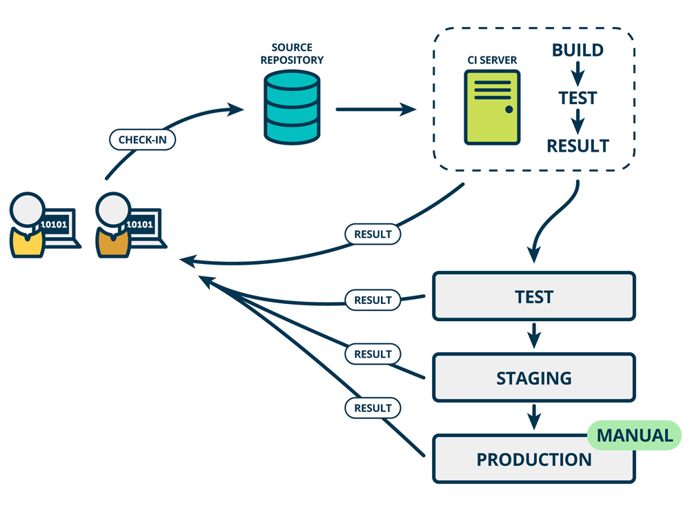
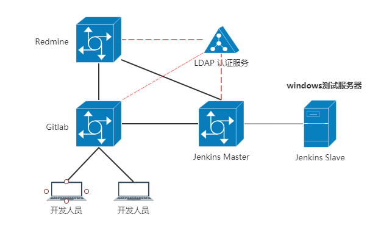

# 项目开发持续集成环境手册
&nbsp;&nbsp;&nbsp;&nbsp;整理 by **[addy](mailto:addy@tom.com)**  2017年10月

---

> 持续集成是指开发者在代码的开发过程中，可以频繁的将代码部署集成到主干，并通过自动化测试后部署到预生产环境。 

### 使用的服务

 -  **Gitlab：**是一个开源的版本管理系统，实现一个自托管的Git项目仓库，可通过Web界面进行访问公开的或者私人项目。它拥有与Github类似的功能，能够浏览源代码，管理缺陷和注释。可以管理团队对仓库的访问，它非常易于浏览提交过的版本并提供一个文件历史库。

    > 作为源代码托管服务，存放开发人员所有代码。

 - **Redmine：**是一个开源的、基于web的项目管理和缺陷跟踪工具。它用日历和甘特图辅助项目及进度可视化显示，同时它支持多项目管理。Redmine是一个自由开放源码软件的解决方案，它提供集成的项目管理功能，问题跟踪，并为多个版本控制的选项的支持。

    > 作为项目管理和bug管理。

 - **Jenkins：**是一个开源软件项目，是基于Java开发的一种持续集成工具，用于监控持续重复的工作，旨在提供一个开放易用的软件平台，使软件的持续集成变成可能。

    > 用于自动化测试构建发布，与Redmine和Gitlab整合，实现自动化测试、发布、提醒。

 - **LDAP：**是轻量目录访问协议，以树状的层次结构来存储数据。

    > 使用LDAP存储用户账号信息，使得各个服务系统能够使用相同账号信息进行访问。

### 部署结构图

* Gitlab是整个环境中的核心，为所有开发人员提供Git服务,并进行人员和群组的权限管理。开发人员可自行建立公开或者私属的版本库。
* Redmine既可以独立使用建立项目进行项目管理，又可以通过web_hook与Gitlab整合，作为指定的版本库的项目管理系统。
* Jenkins通过插件与Gitlab进行整合，可对版本库Git分支进行自动化的编译、测试和部署。同时其自身采用主从模式，主服务器（Linux环境）负责管理任务，从服务器（windows环境）根据主服务器指令完成代码获取、编译、测试以及部署等一系列操作。