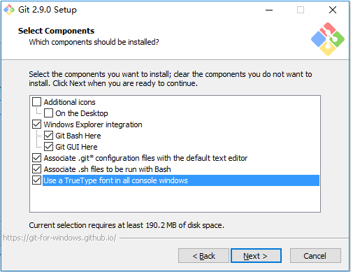
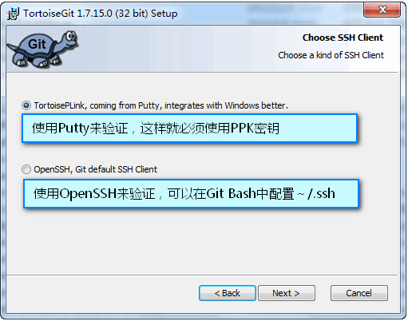
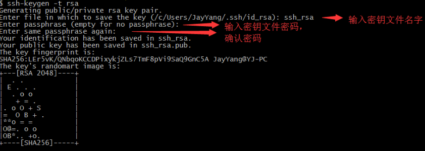
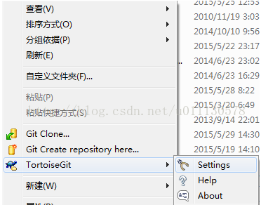
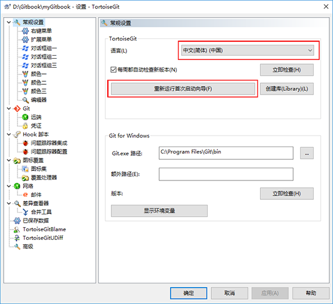
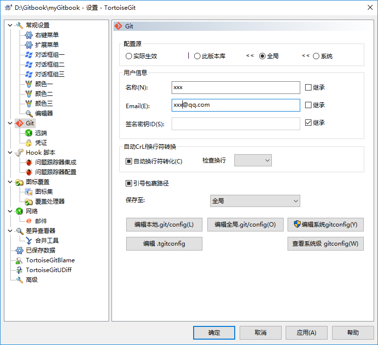
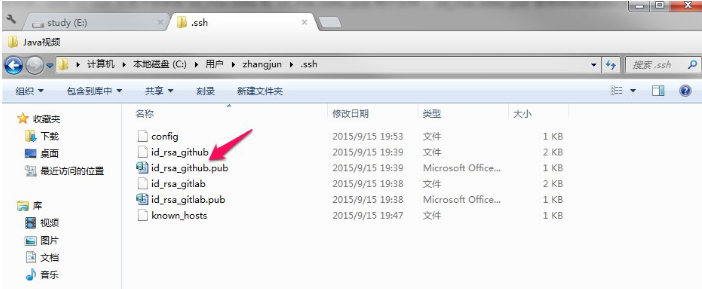
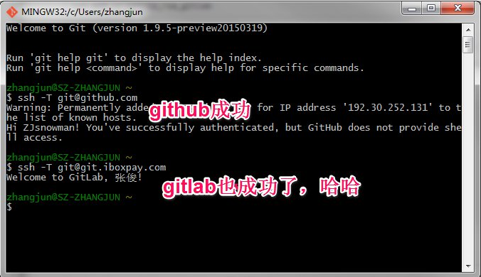

# Git的安装

---

## 1. 安装准备

**Git for windows**：https://git-for-windows.github.io/

​	GIt客户端工具，提供Git BASH、Git GUI、Shell Integration。

**TortoiseGit**：https://tortoisegit.org/  （Git图形界面也可使用**SourceTree**）

​	Git 图形界面工具，提供友好的图形界面并与Windows资源管理器集成	,并提供中文语言包。TortoiseGit依赖于Git for windows。

>根据操作系统下载安装程序：[`32-bit`](https://download.tortoisegit.org/tgit/2.5.0.0/TortoiseGit-2.5.0.0-32bit.msi)或[`64-bit`](https://download.tortoisegit.org/tgit/2.5.0.0/TortoiseGit-2.5.0.0-64bit.msi)，如需中文下载中文语言包：[`32-bit`](https://download.tortoisegit.org/tgit/2.5.0.0/TortoiseGit-LanguagePack-2.5.0.0-32bit-zh_CN.msi)或[`64-bit`](https://download.tortoisegit.org/tgit/2.5.0.0/TortoiseGit-LanguagePack-2.5.0.0-64bit-zh_CN.msi)。


## 2. 安装软件

首先安装`Git for windows`，然后安装`TortoiseGit`，最后安装`中文语言包`。


**安装中需要注意的问题：**

* 安装Git for windows时，如果不需要在右键菜单中添加条目（因TortoiseGit提供更完善的功能菜单），请将`Windows Explorer intergration`的 [x] **去掉**。

  

  ​

* 安装Git for windows时，建议选择`Use Git from the Windows Command Prompt`， 这样在Windows的命令行cmd中也可以运行git命令。

  

  ​

* 安装TortoiseGit时，建议选择选择使用OpenSSH作为SSH客户端，这样命令窗口模式和TortoiseGit模式将使用时将使用相同的SSH key进行验证。

  

  ​

  ​

## 3. 配置Git

### 3\.1 Git生成SSH key

从开始菜单中找到`Git Bash`，打开git的命令行模式。

进入.ssh文件夹。

```shell
cd ~/.ssh
```


配置全局的name和email，这里是的你gitab所注册的用户名和邮箱

```shell
git config --global user.name "xxx"  
  
git config --global user.email "xxx@qq.com"  
```


生成SSH的公钥和私钥，默认文件名为id_rsa文件和id_rsa.pub文件。（如果不设置密码直接敲几次回车即可）

```shell
ssh-keygen -t rsa -C "邮箱地址"
```




### 3.2 配置TortoiseGit

在空白处点击右键可以看到TortoiseGit的选项，选择设置settings.




在配置界面常规设置General中可设置语言，如果默认SSH客户端未配置为`OpenSSH`可通过“重新运行首次启动向导”按键，进行重新设置。




在Git设置项中设置用户名和电子邮件。




也可通过编辑`全局.git/config`按钮手工输入配置项。

```plain
[user]  
    name = xxx                #用户名，体现在提交的日志中  
    email = xxx@qq.com        #邮件地址，体现在提交的日志中  
  
[alias]  #别名，便于使用；比如git co等价于git checkout  
    co = checkout   #j检出  
    ci = commit    #提交  
    dc = svn dcommit   #git-svn同步代码  
    st = status  #查看本地状态  
    di = diff  #查看本地差异  
    br = branch  #查看本地分支  
  
[color]  #显示信息的颜色  
    status = auto  #状态信息颜色，即执行git st显示的信息  
    branch = auto  #分支的颜色，即执行git br显示的信息  
    ui = true #颜色全部打开  
      
[http]  
    sslVerify = false  #避免提交时出现SSL验证错误  
  
[push]  
    default = simple  #默认push策略为simple，push的目的分支如果与本地的分支不同则会拒绝，安全性高一些  
```


## 3. 多个SSH key的存放

当有多个git账号的时候，比如一个github，用于自己进行一些开发活动，再来一个gitlab，一般是公司内部的git。这两者你的邮箱如果不同的话，就会涉及到一个问题，生成第二个git的key的时候会覆盖第一个的key，导致必然有一个用不了。

**问题解决**

我们可以在~/.ssh目录下新建一个config文件配置一下，就可以解决问题

**具体步骤**

- 生成第一个ssh key(这里我用于github，用的gmail邮箱)

```
    ssh-keygen -t rsa -C "yourmail@gmail.com" -f id_rsa_github
```

这里不要一路回传，让你选择在哪里选择存放key的时候写个名字，比如 *id_rsa_github*，之后的两个可以回车。
完成之后我们可以看到~/.ssh目录下多了两个文件




- 生成第二个ssh key（这里我用于gitlab，用的是公司邮箱）

  ```
   ssh-keygen -t rsa -C "yourmail@gmail.com" -f id_rsa_gitlab
  ```

  还是一样不要一路回车，在第一个对话的时候继续写个名字，比如 *id_rsa_gitlab*,之后的两个可以回车。
  完成之后我们可以看到如2中图所标记，一样出现两个文件。（一个公钥一个私钥）

- 打开ssh-agent
  这里如果你用的github官方的bash，`ssh-agent -s`,如果是其他的，比如msysgit,`eval $(ssh-agent -s)`

- 添加私钥

  ```
   ssh-add ~/.ssh/id_rsa_github
   ssh-add ~/.ssh/id_rsa_gitlab
  ```

- 创建并修改config文件

在windows下新建一个txt文本，然后将名字后缀一起改成config即可
在bash下的话直接`touch config` 即可。
添加一下内容

```
    # gitlab
    Host 10.12.110.122
        HostName 10.12.110.122
        PreferredAuthentications publickey
        IdentityFile ~/.ssh/id_rsa_gitlab
        User zhangjun

    # github
    Host github.com
        HostName github.com
        PreferredAuthentications publickey
        IdentityFile ~/.ssh/id_rsa_github
        User ZJsnowman
```

- 在github和gitlab上添加公钥即可，这里不再多说。

- 测试

  

分别测试githab和gitlub

PS:如果到这里你没有成功的话，别急，教你解决问题的终极办法--debug

比如测试github，`ssh -vT git@github.com`    

-v 是输出编译信息，然后根据编译信息自己去解决问题吧。就我自己来说一般是config里的host那块写错了。

------

**补充一下**

如果之前有设置全局用户名和邮箱的话，需要unset一下

```
git config --global --unset user.name
git config --global --unset user.email
```

然后在不同的仓库下设置局部的用户名和邮箱
比如在公司的repository下

`git config user.name "yourname"  `

`git config user.email "youremail"` 

在自己的github的仓库在执行刚刚的命令一遍即可。

**这样就可以在不同的仓库，已不同的账号登录。**

