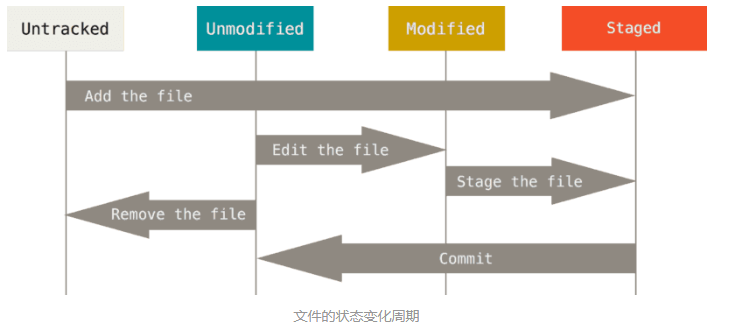

## 2.2 本地版本库的使用

现在我们手上有了一个真实项目的 Git 仓库，并从这个仓库中取出了所有文件的工作拷贝。 接下来，对这些文件做些修改，在完成了一个阶段的目标之后，提交本次更新到仓库。

请记住，你工作目录下的每一个文件都不外乎这两种状态：**已跟踪** 或 **未跟踪** 。 已跟踪的文件是指那些被纳入了版本控制的文件，在上一次快照中有它们的记录，在工作一段时间后，它们的状态可能处于 **未修改**，**已修改** 或 **已放入暂存区**。 

工作目录中除已跟踪文件以外的所有其它文件都属于未跟踪文件，它们既不存在于上次快照的记录中，也没有放入暂存区。 初次克隆某个仓库的时候，工作目录中的所有文件都属于已跟踪文件，并处于未修改状态。

编辑过某些文件之后，由于自上次提交后你对它们做了修改，Git 将它们标记为已修改文件。 我们逐步将这些修改过的文件放入暂存区，然后提交所有暂存了的修改，如此反复。所以使用 Git 时文件的生命周期如下：

文件的状态变化周期

