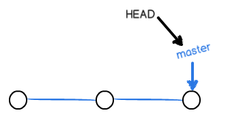
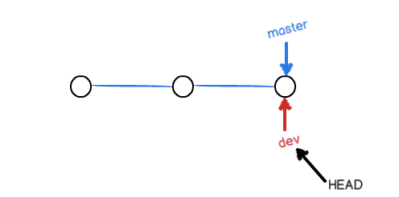
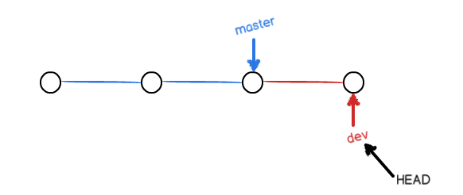
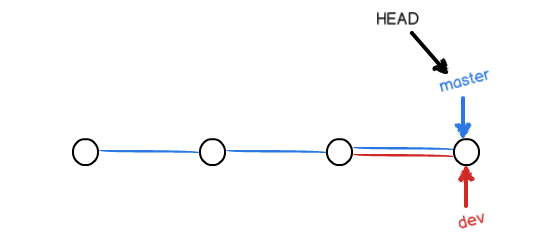
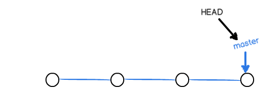
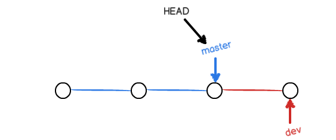
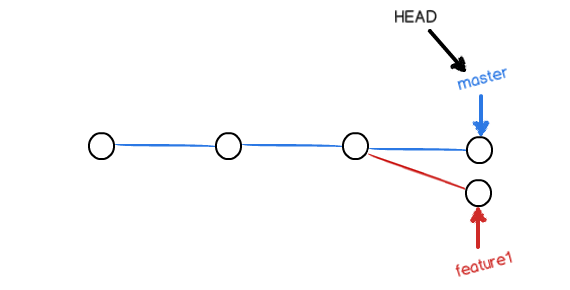
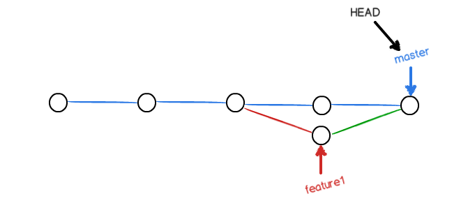
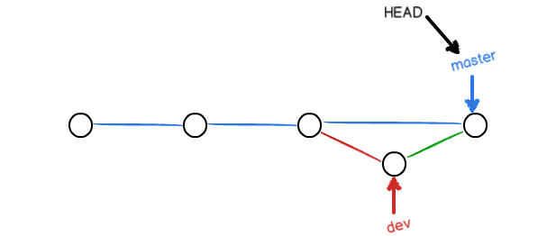
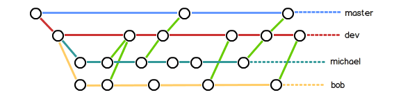

# 2.4 分支管理

> 几乎所有的版本控制系统都以某种形式支持分支。 使用分支意味着你可以把你的工作从开发主线上分离开来，以免影响开发主线。 在很多版本控制系统中，这是一个略微低效的过程——常常需要完全创建一个源代码目录的副本。对于大项目来说，这样的过程会耗费很多时间。

分支就是科幻电影里面的平行宇宙，当你正在电脑前努力学习Git的时候，另一个你正在另一个平行宇宙里努力学习SVN。如果两个平行宇宙互不干扰，那对现在的你也没啥影响。不过，在某个时间点，两个平行宇宙合并了，结果，你既学会了Git又学会了SVN！


分支在实际中有什么用呢？假设你准备开发一个新功能，但是需要两周才能完成，第一周你写了50%的代码，如果立刻提交，由于代码还没写完，不完整的代码库会导致别人不能干活了。如果等代码全部写完再一次提交，又存在丢失每天进度的巨大风险。

现在有了分支，就不用怕了。你创建了一个属于你自己的分支，别人看不到，还继续在原来的分支上正常工作，而你在自己的分支上干活，想提交就提交，直到开发完毕后，再一次性合并到原来的分支上，这样，既安全，又不影响别人工作。


## 2.4.1 创建与合并分支

每次提交，Git都把它们串成一条时间线，这条时间线就是一个分支。截止到目前，只有一条时间线，在Git里，这个分支叫主分支，即`master`分支。`HEAD`严格来说不是指向提交，而是指向`master`，`master`才是指向提交的，所以，`HEAD`指向的就是当前分支。

一开始的时候，`master`分支是一条线，Git用`master`指向最新的提交，再用`HEAD`指向`master`，就能确定当前分支，以及当前分支的提交点：



每次提交，`master`分支都会向前移动一步，这样，随着你不断提交，`master`分支的线也越来越长。

当我们创建新的分支，例如`dev`时，Git新建了一个指针叫`dev`，指向`master`相同的提交，再把`HEAD`指向`dev`，就表示当前分支在`dev`上：



你看，Git创建一个分支很快，因为除了增加一个`dev`指针，改改`HEAD`的指向，工作区的文件都没有任何变化！

不过，从现在开始，对工作区的修改和提交就是针对`dev`分支了，比如新提交一次后，`dev`指针往前移动一步，而`master`指针不变：



假如我们在`dev`上的工作完成了，就可以把`dev`合并到`master`上。Git怎么合并呢？最简单的方法，就是直接把`master`指向`dev`的当前提交，就完成了合并：



所以Git合并分支也很快！就改改指针，工作区内容也不变！

合并完分支后，甚至可以删除`dev`分支。删除`dev`分支就是把`dev`指针给删掉，删掉后，我们就剩下了一条`master`分支：



真是太神奇了，你看得出来有些提交是通过分支完成的吗？


>查看分支：`git branch`
>
>创建分支：`git branch <name>`
>
>切换分支：`git checkout <name>`
>
>创建+切换分支：`git checkout -b <name>`
>
>合并某分支到当前分支：`git merge <name>`
>
>删除分支：`git branch -d <name>`


首先，我们创建`dev`分支，然后切换到`dev`分支：

```shell
$ git checkout -b dev
Switched to a new branch 'dev'
```

`git checkout`命令加上`-b`参数表示创建并切换，相当于以下两条命令：

```shell
$ git branch dev
$ git checkout dev
Switched to branch 'dev'
```

然后，用`git branch`命令查看当前分支：

```shell
$ git branch
* dev
  master
```

`git branch`命令会列出所有分支，当前分支前面会标一个`*`号。

然后，我们就可以在`dev`分支上正常提交，比如对readme.txt做个修改，加上一行：

```shell
Creating a new branch is quick.
```

然后提交：

```shell
$ git add readme.txt 
$ git commit -m "branch test"
[dev fec145a] branch test
 1 file changed, 1 insertion(+)
```

现在，`dev`分支的工作完成，我们就可以切换回`master`分支：

```shell
$ git checkout master
Switched to branch 'master'
```

切换回`master`分支后，再查看一个readme.txt文件，刚才添加的内容不见了！因为那个提交是在`dev`分支上，而`master`分支此刻的提交点并没有变：



现在，我们把`dev`分支的工作成果合并到`master`分支上：

```shell
$ git merge dev
Updating d17efd8..fec145a
Fast-forward
 readme.txt |    1 +
 1 file changed, 1 insertion(+)
```

`git merge`命令用于合并指定分支到当前分支。合并后，再查看readme.txt的内容，就可以看到，和`dev`分支的最新提交是完全一样的。

注意到上面的`Fast-forward`信息，Git告诉我们，这次合并是“快进模式”，也就是直接把`master`指向`dev`的当前提交，所以合并速度非常快。

当然，也不是每次合并都能`Fast-forward`，我们后面会讲其他方式的合并。

合并完成后，就可以放心地删除`dev`分支了：

```shell
$ git branch -d dev
Deleted branch dev (was fec145a).
```

删除后，查看`branch`，就只剩下`master`分支了：

```shell
$ git branch
* master
```

因为创建、合并和删除分支非常快，所以Git鼓励你使用分支完成某个任务，合并后再删掉分支，这和直接在`master`分支上工作效果是一样的，但过程更安全。


## 2.4.2 解决冲突

> 当Git无法自动合并分支时，就必须首先解决冲突。解决冲突后，再提交，合并完成。
>
> 用`git log --graph`命令可以看到分支合并图。

有时候合并操作不会如此顺利。 如果你在两个不同的分支中，对同一个文件的同一个部分进行了不同的修改，Git 就没法干净的合并它们。 

准备新的`feature1`分支，继续我们的新分支开发：

```shell
$ git checkout -b feature1
Switched to a new branch 'feature1'
```

修改readme.txt最后一行，改为：

```
Creating a new branch is quick AND simple.

```

在`feature1`分支上提交：

```shell
$ git add readme.txt 
$ git commit -m "AND simple"
[feature1 75a857c] AND simple
 1 file changed, 1 insertion(+), 1 deletion(-)
```

切换到`master`分支：

```shell
$ git checkout master
Switched to branch 'master'
Your branch is ahead of 'origin/master' by 1 commit.
```

Git还会自动提示我们当前`master`分支比远程的`master`分支要超前1个提交。

在`master`分支上把readme.txt文件的最后一行改为：

```
Creating a new branch is quick & simple.
```

提交：

```shell
$ git add readme.txt 
$ git commit -m "& simple"
[master 400b400] & simple
 1 file changed, 1 insertion(+), 1 deletion(-)
```

现在，`master`分支和`feature1`分支各自都分别有新的提交，变成了这样：



这种情况下，Git无法执行“快速合并”，只能试图把各自的修改合并起来，但这种合并就可能会有冲突，我们试试看：

```shell
$ git merge feature1
Auto-merging readme.txt
CONFLICT (content): Merge conflict in readme.txt
Automatic merge failed; fix conflicts and then commit the result.
```

果然冲突了！Git告诉我们，readme.txt文件存在冲突，必须手动解决冲突后再提交。`git status`也可以告诉我们冲突的文件：

```shell
$ git status
# On branch master
# Your branch is ahead of 'origin/master' by 2 commits.
#
# Unmerged paths:
#   (use "git add/rm <file>..." as appropriate to mark resolution)
#
#       both modified:      readme.txt
#
no changes added to commit (use "git add" and/or "git commit -a")
```

我们可以直接查看readme.txt的内容：

```shell
Git is a distributed version control system.
Git is free software distributed under the GPL.
Git has a mutable index called stage.
Git tracks changes of files.
<<<<<<< HEAD
Creating a new branch is quick & simple.
=======
Creating a new branch is quick AND simple.
>>>>>>> feature1
```

Git用`<<<<<<<`，`=======`，`>>>>>>>`标记出不同分支的内容，我们修改如下后保存：

```
Creating a new branch is quick and simple.

```

再提交：

```shell
$ git add readme.txt 
$ git commit -m "conflict fixed"
[master 59bc1cb] conflict fixed
```

现在，`master`分支和`feature1`分支变成了下图所示：



用带参数的`git log`也可以看到分支的合并情况：

```shell
$ git log --graph --pretty=oneline --abbrev-commit
*   59bc1cb conflict fixed
|\
| * 75a857c AND simple
* | 400b400 & simple
|/
* fec145a branch test
...
```

最后，删除`feature1`分支：

```shell
$ git branch -d feature1
Deleted branch feature1 (was 75a857c).
```

工作完成。


## 2.4.3 分支管理策略

通常，合并分支时，如果可能，Git会用`Fast forward`模式，但这种模式下，删除分支后，会丢掉分支信息。

如果要强制禁用`Fast forward`模式，Git就会在merge时生成一个新的commit，这样，从分支历史上就可以看出分支信息。

下面我们实战一下`--no-ff`方式的`git merge`：

首先，仍然创建并切换`dev`分支：

```shell
$ git checkout -b dev
Switched to a new branch 'dev'
```

修改readme.txt文件，并提交一个新的commit：

```shell
$ git add readme.txt 
$ git commit -m "add merge"
[dev 6224937] add merge
 1 file changed, 1 insertion(+)
```

现在，我们切换回`master`：

```shell
$ git checkout master
Switched to branch 'master'
```

准备合并`dev`分支，请注意`--no-ff`参数，表示禁用`Fast forward`：

```shell
$ git merge --no-ff -m "merge with no-ff" dev
Merge made by the 'recursive' strategy.
 readme.txt |    1 +
 1 file changed, 1 insertion(+)
```

因为本次合并要创建一个新的commit，所以加上`-m`参数，把commit描述写进去。

合并后，我们用`git log`看看分支历史：

```shell
$ git log --graph --pretty=oneline --abbrev-commit
*   7825a50 merge with no-ff
|\
| * 6224937 add merge
|/
*   59bc1cb conflict fixed
...
```

可以看到，不使用`Fast forward`模式，merge后就像这样：




**分支策略**

在实际开发中，我们应该按照几个基本原则进行分支管理：

首先，`master`分支应该是非常稳定的，也就是仅用来发布新版本，平时不能在上面干活；

那在哪干活呢？干活都在`dev`分支上，也就是说，`dev`分支是不稳定的，到某个时候，比如1.0版本发布时，再把`dev`分支合并到`master`上，在`master`分支发布1.0版本；

你和你的小伙伴们每个人都在`dev`分支上干活，每个人都有自己的分支，时不时地往`dev`分支上合并就可以了。

所以，团队合作的分支看起来就像这样：



**小结**

Git分支十分强大，在团队开发中应该充分应用。

合并分支时，加上`--no-ff`参数就可以用普通模式合并，合并后的历史有分支，能看出来曾经做过合并，而`fast forward`合并就看不出来曾经做过合并。


##  2.4.4 Bug分支

软件开发中，bug就像家常便饭一样。有了bug就需要修复，在Git中，由于分支是如此的强大，所以，每个bug都可以通过一个新的临时分支来修复，修复后，合并分支，然后将临时分支删除。

当你接到一个修复一个代号101的bug的任务时，很自然地，你想创建一个分支`issue-101`来修复它，但是，等等，当前正在`dev`上进行的工作还没有提交：

```shell
$ git status
# On branch dev
# Changes to be committed:
#   (use "git reset HEAD <file>..." to unstage)
#
#       new file:   hello.py
#
# Changes not staged for commit:
#   (use "git add <file>..." to update what will be committed)
#   (use "git checkout -- <file>..." to discard changes in working directory)
#
#       modified:   readme.txt
#
```

并不是你不想提交，而是工作只进行到一半，还没法提交，预计完成还需1天时间。但是，必须在两个小时内修复该bug，怎么办？

幸好，Git还提供了一个`stash`功能，可以把当前工作现场“储藏”起来，等以后恢复现场后继续工作：

```shell
$ git stash
Saved working directory and index state WIP on dev: 6224937 add merge
HEAD is now at 6224937 add merge
```

现在，用`git status`查看工作区，就是干净的（除非有没有被Git管理的文件），因此可以放心地创建分支来修复bug。

首先确定要在哪个分支上修复bug，假定需要在`master`分支上修复，就从`master`创建临时分支：

```shell
$ git checkout master
Switched to branch 'master'
Your branch is ahead of 'origin/master' by 6 commits.
$ git checkout -b issue-101
Switched to a new branch 'issue-101'
```

现在修复bug，需要把“Git is free software ...”改为“Git is a free software ...”，然后提交：

```shell
$ git add readme.txt 
$ git commit -m "fix bug 101"
[issue-101 cc17032] fix bug 101
 1 file changed, 1 insertion(+), 1 deletion(-)
```

修复完成后，切换到`master`分支，并完成合并，最后删除`issue-101`分支：

```shell
$ git checkout master
Switched to branch 'master'
Your branch is ahead of 'origin/master' by 2 commits.
$ git merge --no-ff -m "merged bug fix 101" issue-101
Merge made by the 'recursive' strategy.
 readme.txt |    2 +-
 1 file changed, 1 insertion(+), 1 deletion(-)
$ git branch -d issue-101
Deleted branch issue-101 (was cc17032).
```

太棒了，原计划两个小时的bug修复只花了5分钟！现在，是时候接着回到`dev`分支干活了！

```shell
$ git checkout dev
Switched to branch 'dev'
$ git status
# On branch dev
nothing to commit (working directory clean)
```

工作区是干净的，刚才的工作现场存到哪去了？用`git stash list`命令看看：

```shell
$ git stash list
stash@{0}: WIP on dev: 6224937 add merge
```

工作现场还在，Git把stash内容存在某个地方了，但是需要恢复一下，有两个办法：

一是用`git stash apply`恢复，但是恢复后，stash内容并不删除，你需要用`git stash drop`来删除；

另一种方式是用`git stash pop`，恢复的同时把stash内容也删了：

```shell
$ git stash pop
# On branch dev
# Changes to be committed:
#   (use "git reset HEAD <file>..." to unstage)
#
#       new file:   hello.py
#
# Changes not staged for commit:
#   (use "git add <file>..." to update what will be committed)
#   (use "git checkout -- <file>..." to discard changes in working directory)
#
#       modified:   readme.txt
#
Dropped refs/stash@{0} (f624f8e5f082f2df2bed8a4e09c12fd2943bdd40)
```

再用`git stash list`查看，就看不到任何stash内容了：

```shell
$ git stash list
```

你可以多次stash，恢复的时候，先用`git stash list`查看，然后恢复指定的stash，用命令：

```shell
$ git stash apply stash@{0}
```

 **小结**

修复bug时，我们会通过创建新的bug分支进行修复，然后合并，最后删除；

当手头工作没有完成时，先把工作现场`git stash`一下，然后去修复bug，修复后，再`git stash pop`，回到工作现场。


## 2.4.5 Feature分支

软件开发中，总有无穷无尽的新的功能要不断添加进来。

添加一个新功能时，你肯定不希望因为一些实验性质的代码，把主分支搞乱了，所以，每添加一个新功能，最好新建一个feature分支，在上面开发，完成后，合并，最后，删除该feature分支。

现在，你终于接到了一个新任务：开发代号为Vulcan的新功能，该功能计划用于下一代星际飞船。

于是准备开发：

``` 
$ git checkout -b feature-vulcan
Switched to a new branch 'feature-vulcan'
```

5分钟后，开发完毕：

``` shell
$ git add vulcan.py
$ git status
# On branch feature-vulcan
# Changes to be committed:
#   (use "git reset HEAD <file>..." to unstage)
#
#       new file:   vulcan.py
#
$ git commit -m "add feature vulcan"
[feature-vulcan 756d4af] add feature vulcan
 1 file changed, 2 insertions(+)
 create mode 100644 vulcan.py
```

切回`dev`，准备合并：

``` shell
$ git checkout dev
```

一切顺利的话，feature分支和bug分支是类似的，合并，然后删除。

但是，

就在此时，接到上级命令，因经费不足，新功能必须取消！

虽然白干了，但是这个分支还是必须就地销毁：

``` shell
$ git branch -d feature-vulcan
error: The branch 'feature-vulcan' is not fully merged.
If you are sure you want to delete it, run 'git branch -D feature-vulcan'.
```

销毁失败。Git友情提醒，`feature-vulcan`分支还没有被合并，如果删除，将丢失掉修改，如果要强行删除，需要使用命令`git branch -D feature-vulcan`。

现在我们强行删除：

```shell
$ git branch -D feature-vulcan
Deleted branch feature-vulcan (was 756d4af).
```

终于删除成功！

**小结**

开发一个新feature，最好新建一个分支；

如果要丢弃一个没有被合并过的分支，可以通过`git branch -D <name>`强行删除。


## 2.4.6 多人协作

当你从远程仓库克隆时，实际上Git自动把本地的`master`分支和远程的`master`分支对应起来了，并且，远程仓库的默认名称是`origin`。

要查看远程库的信息，用`git remote`：

```shell
$ git remote
origin
```

或者，用`git remote -v`显示更详细的信息：

```shell
$ git remote -v
origin  git@github.com:michaelliao/learngit.git (fetch)
origin  git@github.com:michaelliao/learngit.git (push)
```

上面显示了可以抓取和推送的`origin`的地址。如果没有推送权限，就看不到push的地址。

### 推送分支

推送分支，就是把该分支上的所有本地提交推送到远程库。推送时，要指定本地分支，这样，Git就会把该分支推送到远程库对应的远程分支上：

```shell
$ git push origin master
```

如果要推送其他分支，比如`dev`，就改成：

```shell
$ git push origin dev
```

但是，并不是一定要把本地分支往远程推送，那么，哪些分支需要推送，哪些不需要呢？

- `master`分支是主分支，因此要时刻与远程同步；
- `dev`分支是开发分支，团队所有成员都需要在上面工作，所以也需要与远程同步；
- bug分支只用于在本地修复bug，就没必要推到远程了，除非老板要看看你每周到底修复了几个bug；
- feature分支是否推到远程，取决于你是否和你的小伙伴合作在上面开发。

总之，就是在Git中，分支完全可以在本地自己藏着玩，是否推送，视你的心情而定！

### 抓取分支

多人协作时，大家都会往`master`和`dev`分支上推送各自的修改。

现在，模拟一个你的小伙伴，可以在另一台电脑（注意要把SSH Key添加到GitHub）或者同一台电脑的另一个目录下克隆：

```shell
$ git clone git@github.com:michaelliao/learngit.git
Cloning into 'learngit'...
remote: Counting objects: 46, done.
remote: Compressing objects: 100% (26/26), done.
remote: Total 46 (delta 16), reused 45 (delta 15)
Receiving objects: 100% (46/46), 15.69 KiB | 6 KiB/s, done.
Resolving deltas: 100% (16/16), done.
```

当你的小伙伴从远程库clone时，默认情况下，你的小伙伴只能看到本地的`master`分支。不信可以用`git branch`命令看看：

```shell
$ git branch
* master
```

现在，你的小伙伴要在`dev`分支上开发，就必须创建远程`origin`的`dev`分支到本地，于是他用这个命令创建本地`dev`分支：

```shell
$ git checkout -b dev origin/dev
```

现在，他就可以在`dev`上继续修改，然后，时不时地把`dev`分支`push`到远程：

```shell
$ git commit -m "add /usr/bin/env"
[dev 291bea8] add /usr/bin/env
 1 file changed, 1 insertion(+)
$ git push origin dev
Counting objects: 5, done.
Delta compression using up to 4 threads.
Compressing objects: 100% (2/2), done.
Writing objects: 100% (3/3), 349 bytes, done.
Total 3 (delta 0), reused 0 (delta 0)
To git@github.com:michaelliao/learngit.git
   fc38031..291bea8  dev -> dev
```

你的小伙伴已经向`origin/dev`分支推送了他的提交，而碰巧你也对同样的文件作了修改，并试图推送：

```shell
$ git add hello.py 
$ git commit -m "add coding: utf-8"
[dev bd6ae48] add coding: utf-8
 1 file changed, 1 insertion(+)
$ git push origin dev
To git@github.com:michaelliao/learngit.git
 ! [rejected]        dev -> dev (non-fast-forward)
error: failed to push some refs to 'git@github.com:michaelliao/learngit.git'
hint: Updates were rejected because the tip of your current branch is behind
hint: its remote counterpart. Merge the remote changes (e.g. 'git pull')
hint: before pushing again.
hint: See the 'Note about fast-forwards' in 'git push --help' for details.
```

推送失败，因为你的小伙伴的最新提交和你试图推送的提交有冲突，解决办法也很简单，Git已经提示我们，先用`git pull`把最新的提交从`origin/dev`抓下来，然后，在本地合并，解决冲突，再推送：

```shell
$ git pull
remote: Counting objects: 5, done.
remote: Compressing objects: 100% (2/2), done.
remote: Total 3 (delta 0), reused 3 (delta 0)
Unpacking objects: 100% (3/3), done.
From github.com:michaelliao/learngit
   fc38031..291bea8  dev        -> origin/dev
There is no tracking information for the current branch.
Please specify which branch you want to merge with.
See git-pull(1) for details

    git pull <remote> <branch>

If you wish to set tracking information for this branch you can do so with:

    git branch --set-upstream dev origin/<branch>
```

`git pull`也失败了，原因是没有指定本地`dev`分支与远程`origin/dev`分支的链接，根据提示，设置`dev`和`origin/dev`的链接：

```shell
$ git branch --set-upstream dev origin/dev
Branch dev set up to track remote branch dev from origin.
```

再pull：

```shell
$ git pull
Auto-merging hello.py
CONFLICT (content): Merge conflict in hello.py
Automatic merge failed; fix conflicts and then commit the result.
```

这回`git pull`成功，但是合并有冲突，需要手动解决，解决的方法和分支管理中的[解决冲突](http://www.liaoxuefeng.com/wiki/0013739516305929606dd18361248578c67b8067c8c017b000/001375840202368c74be33fbd884e71b570f2cc3c0d1dcf000)完全一样。解决后，提交，再push：

```shell
$ git commit -m "merge & fix hello.py"
[dev adca45d] merge & fix hello.py
$ git push origin dev
Counting objects: 10, done.
Delta compression using up to 4 threads.
Compressing objects: 100% (5/5), done.
Writing objects: 100% (6/6), 747 bytes, done.
Total 6 (delta 0), reused 0 (delta 0)
To git@github.com:michaelliao/learngit.git
   291bea8..adca45d  dev -> dev
```

因此，多人协作的工作模式通常是这样：

1. 首先，可以试图用`git push origin branch-name`推送自己的修改；
2. 如果推送失败，则因为远程分支比你的本地更新，需要先用`git pull`试图合并；
3. 如果合并有冲突，则解决冲突，并在本地提交；
4. 没有冲突或者解决掉冲突后，再用`git push origin branch-name`推送就能成功！

如果`git pull`提示“no tracking information”，则说明本地分支和远程分支的链接关系没有创建，用命令`git branch --set-upstream branch-name origin/branch-name`。

这就是多人协作的工作模式，一旦熟悉了，就非常简单。

**小结**

- 查看远程库信息，使用`git remote -v`；
- 本地新建的分支如果不推送到远程，对其他人就是不可见的；
- 从本地推送分支，使用`git push origin branch-name`，如果推送失败，先用`git pull`抓取远程的新提交；
- 在本地创建和远程分支对应的分支，使用`git checkout -b branch-name origin/branch-name`，本地和远程分支的名称最好一致；
- 建立本地分支和远程分支的关联，使用`git branch --set-upstream branch-name origin/branch-name`；
- 从远程抓取分支，使用`git pull`，如果有冲突，要先处理冲突。