##  2.7 Gui界面的使用

### 2.7.1 创建版本库

创建仓库很简单，在文件夹上右击->Git Create repository here…即可。 

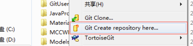


如果创建仓库时仓库对应的文件夹中有文件，那Git Create repository here…之后还要Commit一下。 

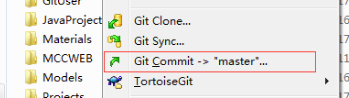


### 2.7.2 克隆版本库

打开资源管理器(我的电脑/计算机), 进入规划好的某个目录中, 然后在空白处点击鼠标右键, 选择 TortoiseGit --> 克隆... (Clone...)。

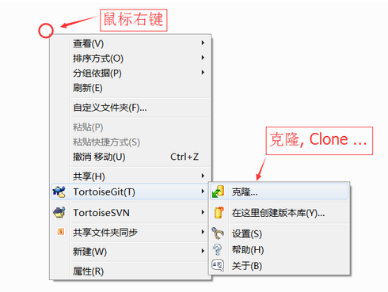

弹出克隆项目对话框:

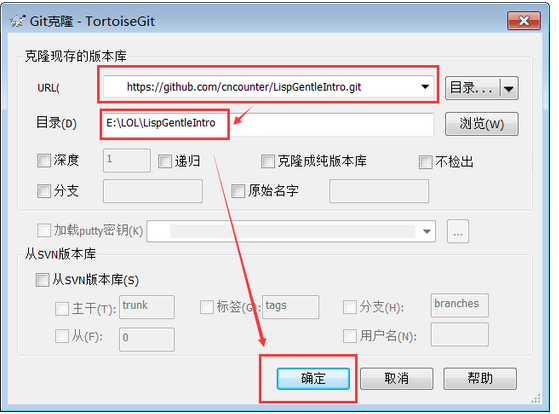

在对话框的 URL中输入项目地址,如:

```
https://github.com/cncounter/LispGentleIntro.git

```

确定本地目录,然后点击 确定 按钮. 等待完成后,点击关闭按钮即可.

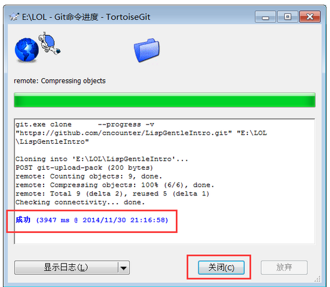


### 2.7.3 更新版本库内容

如果本地的项目没有在线仓库的新,则需要执行拉取操作(Pull ...).

在本地项目的空白处点击鼠标右键, 选择 TortoiseGit --> 拉取... 或: Pull....

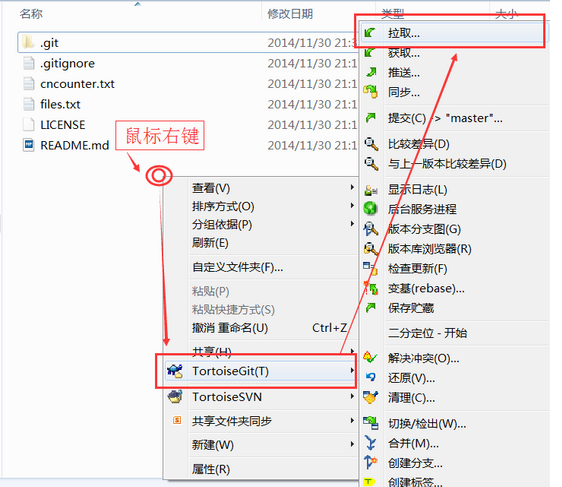

弹出拉取(pull)对话框:

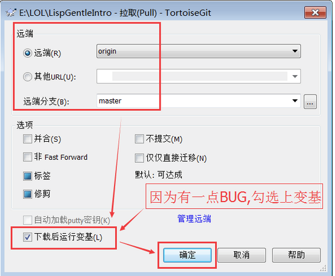

如果拉取有BUG，则可以勾选上变基(不报错就别勾选了!!!), 确定,进入 拉取进度界面:

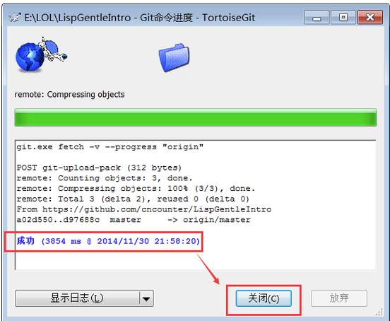

然后执行变基:

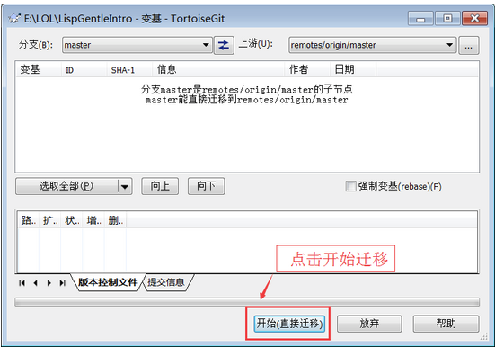

然后完成即可.


### 2.7.4 修改提交

项目克隆完成后(可以将克隆 clone 理解为 下载, 检出 checkout 操作). 修改本地项目中的某些文件,如 将 `README.md` 修改为如下内容:

```
LispGentleIntro
===============

Lisp-符号计算入门指引翻译

<a href="http://cncounter.duapp.com/">天朝计数器</a>
```

还可以试试增加一些文件. 如  `files.txt`  .

然后在本地项目的空白处点击鼠标右键, 选择 TortoiseGit --> 提交(C) -> "master"... 或: Commit -> "master"....

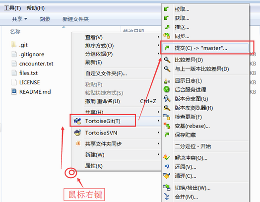

弹出提交（Commit）对话框:

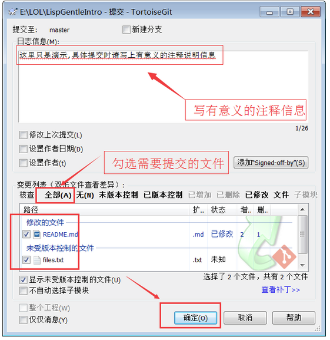

作为好习惯,填写提交日志,勾选需要提交的文件,然后点击 "确定" 按钮, 即提交到本地仓库.

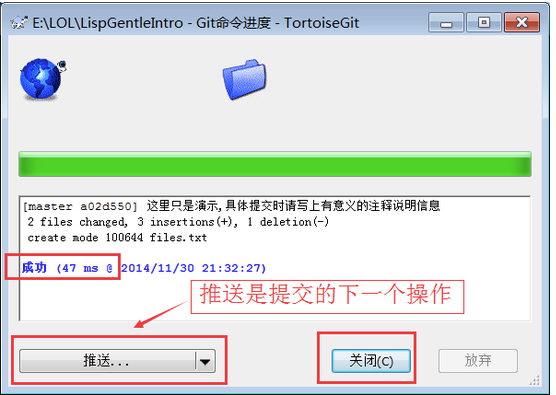


### 2.7.5 推送到在线仓库

推送是提交的下一步操作.

在本地项目的空白处点击鼠标右键, 选择 TortoiseGit --> 推送... 或: Push....

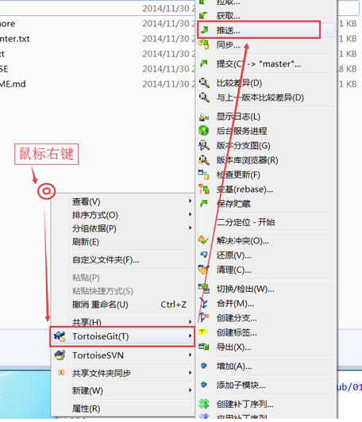

弹出推送(push)对话框:

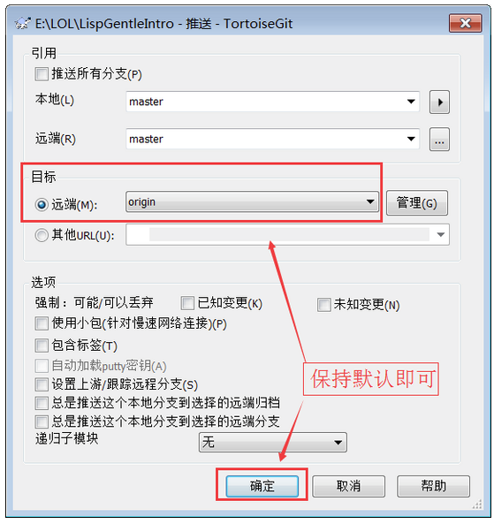

一般保持默认,点击 “ 确定 ” 按钮.

然后弹出推送进度界面, 可能要求你输入用户名:

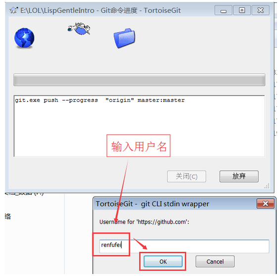

确定OK，然后要求输入密码:

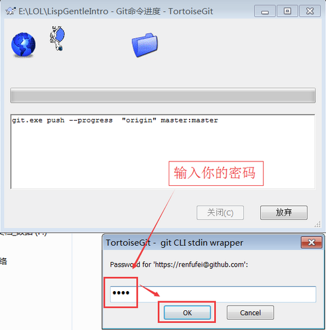

密码输入正确后,OK，显示推送成功界面:

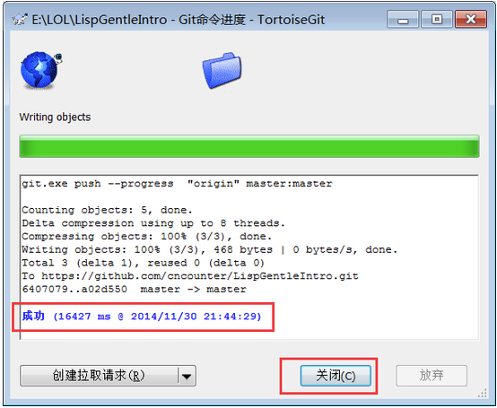


### 2.7.5 查看修改记录

我们打开本地仓库中的项目文件，对其进行编辑然后Commit，就会在Log中产生提交记录，我们可以查看每次Commit所提交的文件，及每个文件产生的变化。 
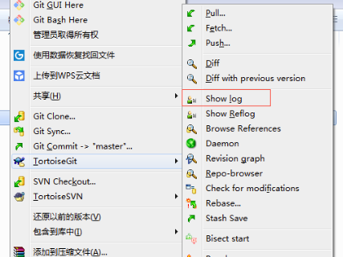

 


### 2.7.6 分支操作

#### 创建分支

点击右键选择TortoiseGit，选择Create Branch…，在Branch框中填写新分支的名称（若选中”switch to new branch”则直接转到新分支上，省去第二步），点击OK按钮：

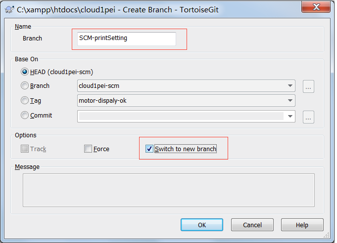 


通过“Switch/Checkout”切换到新创建的分支上，点击OK：  

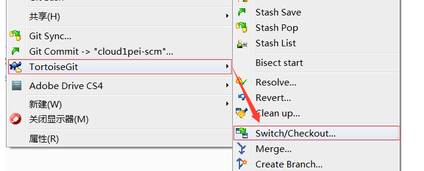

 

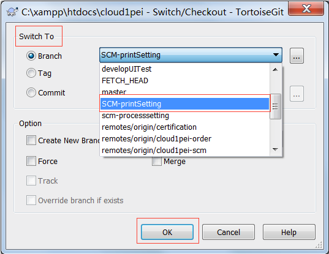 


在新分支下执行PUSH操作，在对话框中保持远程分支为空白，点击OK，则将在远程创建了新的分支（在PUSH的时候远程服务器发现远程没有该分支，此时会自动创建一个和本地分支名称一样的分支，并将本地分支的内容上传到该分支）。 

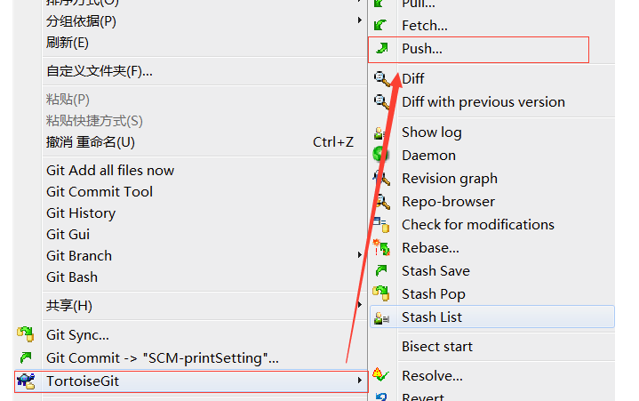

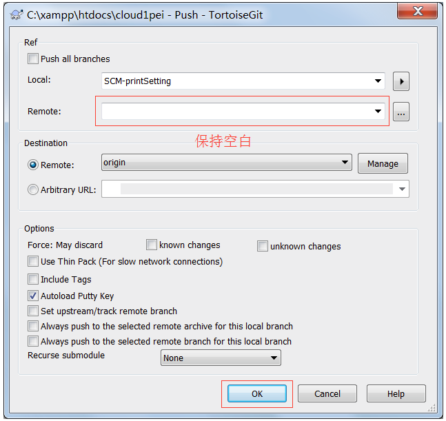


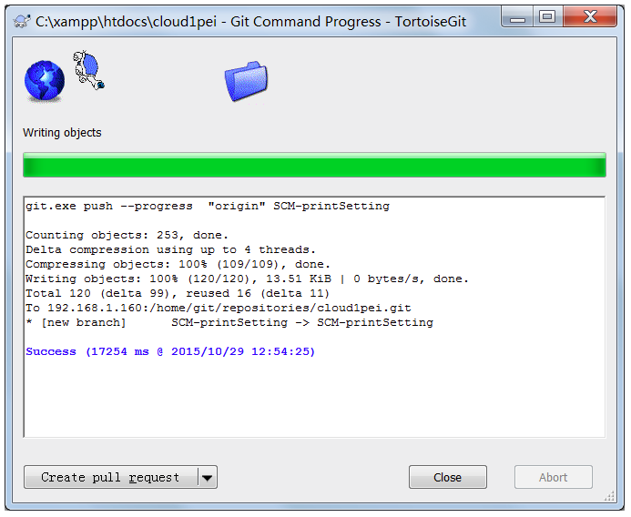

 

#### 切换该新分支

首先进行pull操作， 然后进行切换分支（如第二步）

 

#### 分区合并

​         进行分支合并之前我们需要明确哪个分支将要合并到哪个分支，首先通过“Switch/CheckOut”切换到主干分支（如develop分支）,然后通过“Merge”继进行合并操作，在对话框中选择需要合并的分支。

分支合并成功后，我们即可以通过Commit与PUSH操作将合并上传到中心服务器。

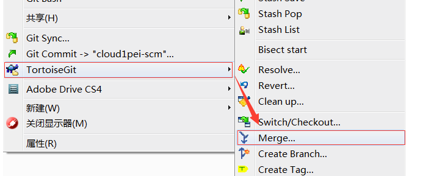 


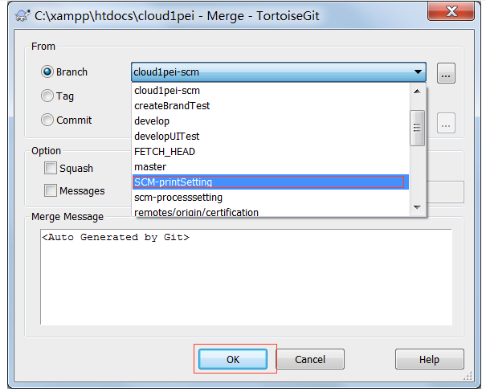

 

#### 删除分支

​       当我们已将新分支合并到主分支后，或者放弃该分支的时候，可以对该分支进行删除操作。

首先通过“CheckOut/Switch”打开对话框，点击Switch to区域中Branch条目后面的更多按钮，打开分支列表对话框，右键点击要删除的分支，选择delete branch进行删除。

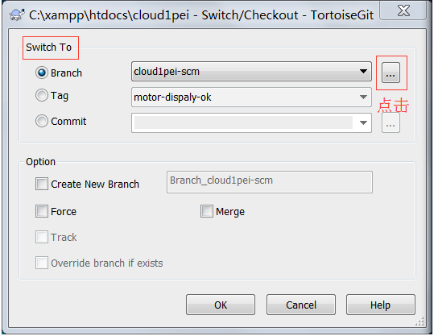

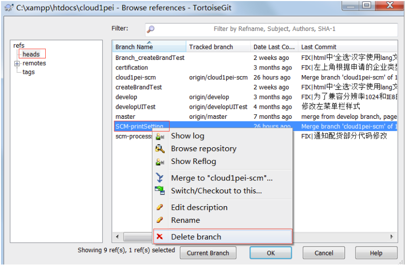 

 

注意，在删除远程分支的时候，本地分支并不会删除，这也说明了本地分支与远程分支并无从属关系


