## LDAP服务器的管理

> 多个系统的整合采用LDAP集中管理账号，可以把它理解成一个读强写弱的文件类型数据库。为了让各个系统使用相同的账号密码信息，我们把账户信息保存在LDAP中，各系统均使用该LDAP进行登录验证。
>
> 整个环境中的账号存储在LDAP中，这里采用LDAP Account Manager (LAM)来提供LDAP目录的web前端管理功能。
>
> 管理地址：http://10.12.110.122/ldap
>
> LDAP 根目录：`dc=hrunicom,dc=local `
>
> LDAP管理员账号：admin

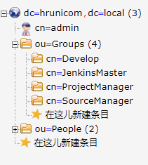

**ou=Groups, dc=hrunicom, dc=local**

> 存放用户组的OU，各系统的账号权限识别就是基于这里的各个分组。
>
> SourceManager：源代码管理组，该组成员能够访问Gitlab系统。
>
> ProjetManager：项目管理组，该组成员能够访问Redmine项目管理系统。
>
> JenkinsMaster：持续集成主服务组，该组成员能够访问Jenkins的主服务器。

**ou=People, dc=hrunicom, dc=local**

> 存放用户账号信息。`用户账号`、`用户姓名` 和 `电子邮箱` 必须填写。

## 登录系统

访问网址：http://10.12.110.122/ldap

输入管理员密码进行登录。

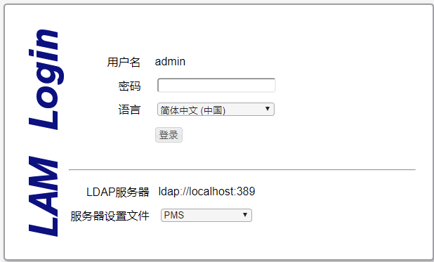

进入系统后可看到目前的账号信息。

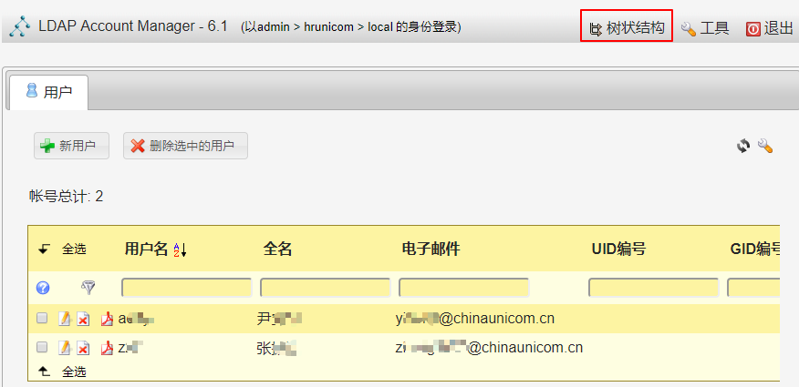

由于使用了LDAP的MemberOf功能，此界面下的用户管理功能中无法对用户所属分组进行直接设置。

也可以使用树状结构查看信息。

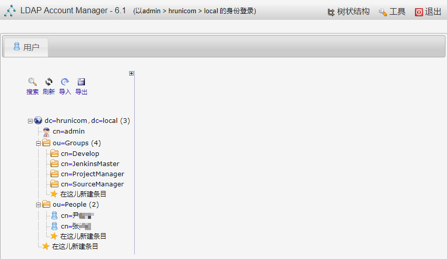

## 新建用户

在用户界面点击`新用户` 按钮进行新建用户操作。**其中用户名、姓、名字、全名和电子邮件必须填写**。

*由于使用了LDAP的MemberOf功能，此界面下的用户管理无法对用户所属分组进行设置。*

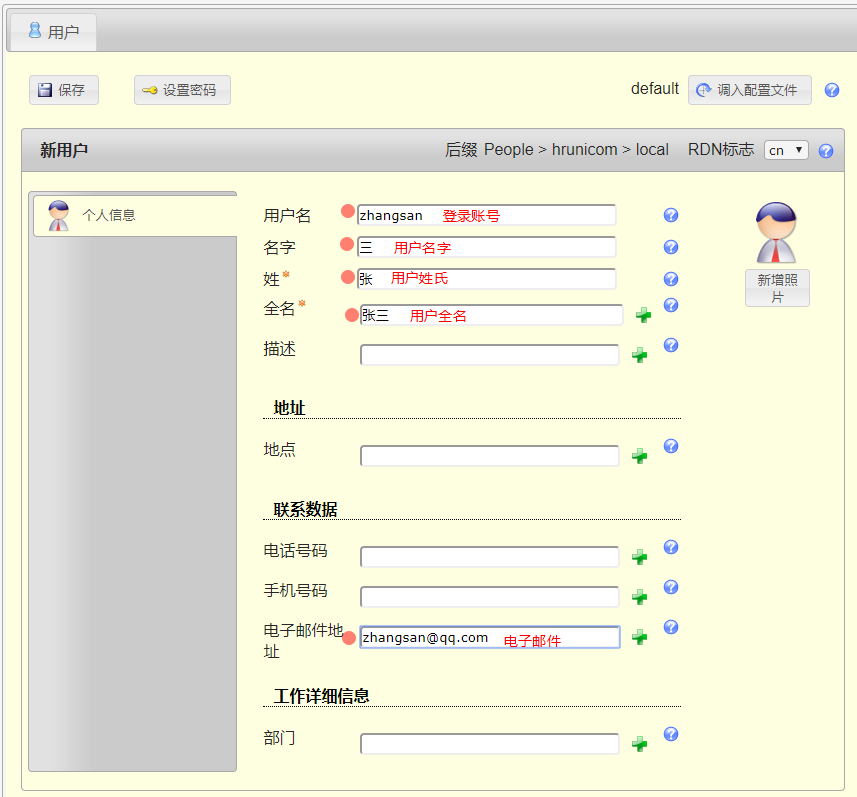

可通过`设置密码` 按钮设置该用户密码，并通过`保存` 按钮存储信息。

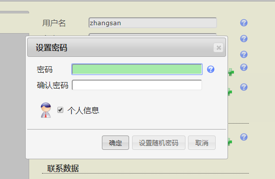

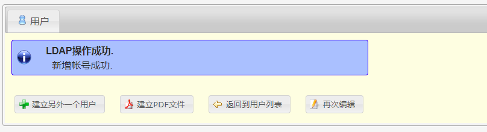

返回用户页面，该用户已经存在。

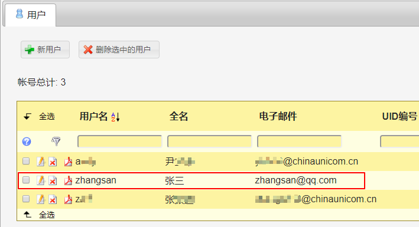

##  账号设置分组

切换到树形结构视图模式，点击用户所属的分组名称 TestGroup，右侧显示出该分组信息。

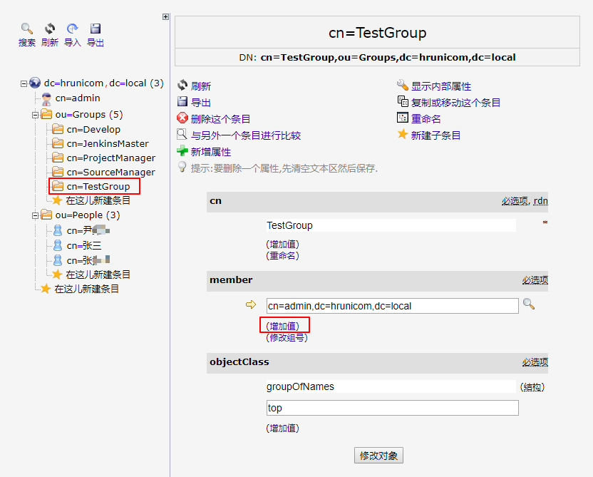

点击 member属性下的“增加值”链接，将会增加一行空白项。

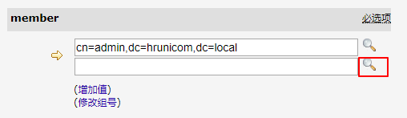

在空白项中直接输入用户信息 `cn=张三, ou=People, dc=hrunicom, dc=local` 或者点击空白项右侧的放大镜图标，将弹出新窗口显示当前LDAP中的组织结构，选择ou=People项后显示出所有用户列表，点击你需要加入该组的用户项。

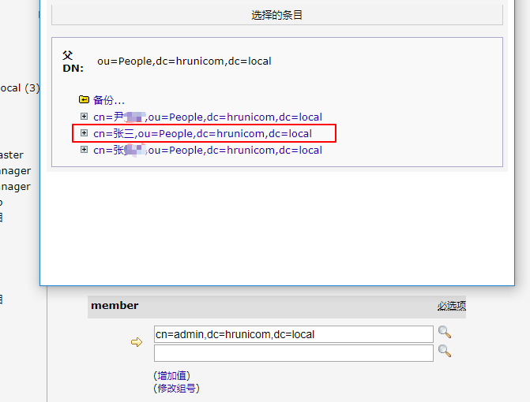

窗口自动关闭，用户信息将自动添加到空白项中。

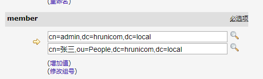

点击页面下方`修改对象` 按钮提交修改。显示本次修改内容，并等待确认。

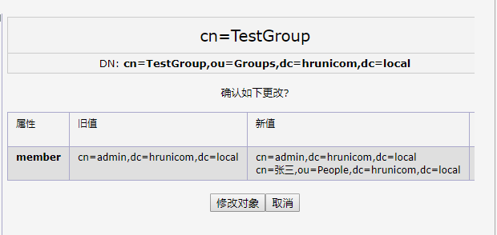

继续点击`修改对象` 后数据提交成功并自动返回分组信息页面，你将能看到你所添加的用户。

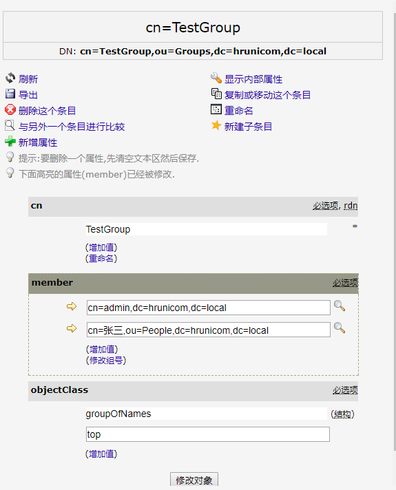

## 新建分组

首先使用树形结构显示目录信息，展开`ou=Groups` 结构，点击“在这儿新建条目"

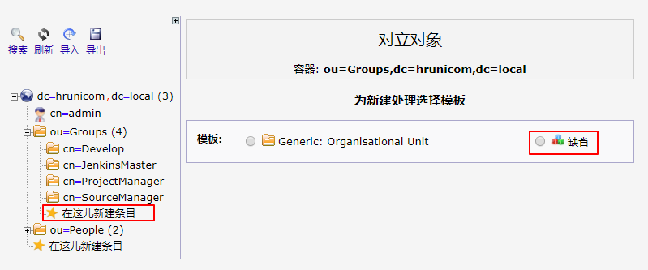

选择“缺省”，将显示出来添加分组的各属性页面：

> RDN: 选择cn
>
> cn : 输入分组名称，建议使用英文字母
>
> member：分组内成员，可选择cn=admin, dc=hrunicom, dc=local

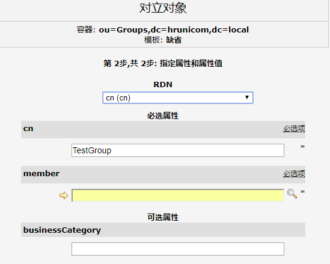

点击member右侧的放大镜图标，将弹出用户选择窗口。如果暂时无组内用户可选择admin。

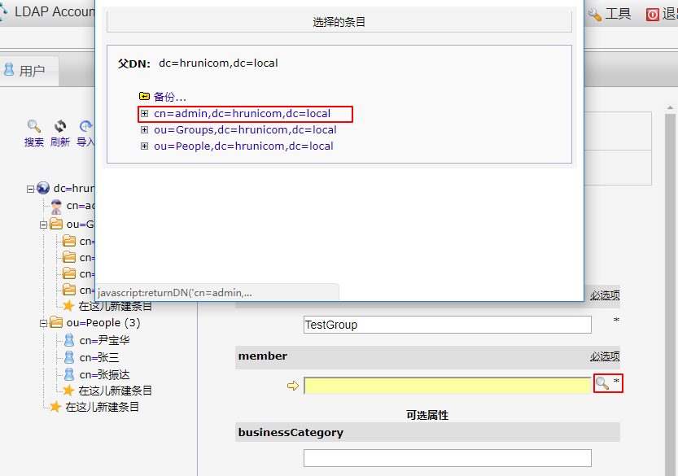

选择用户后，弹出窗口关闭，自动填入分组成员信息。

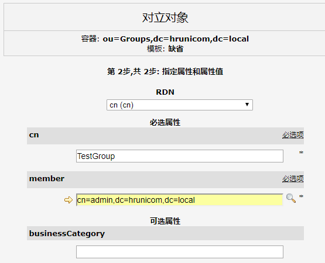

点击页面下方提交按钮，进行数据确认。

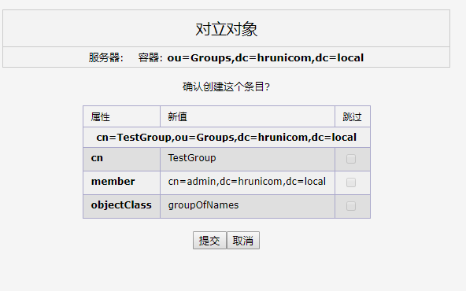

继续提交，数据保存成功后返回到新建分组的具体信息页面。

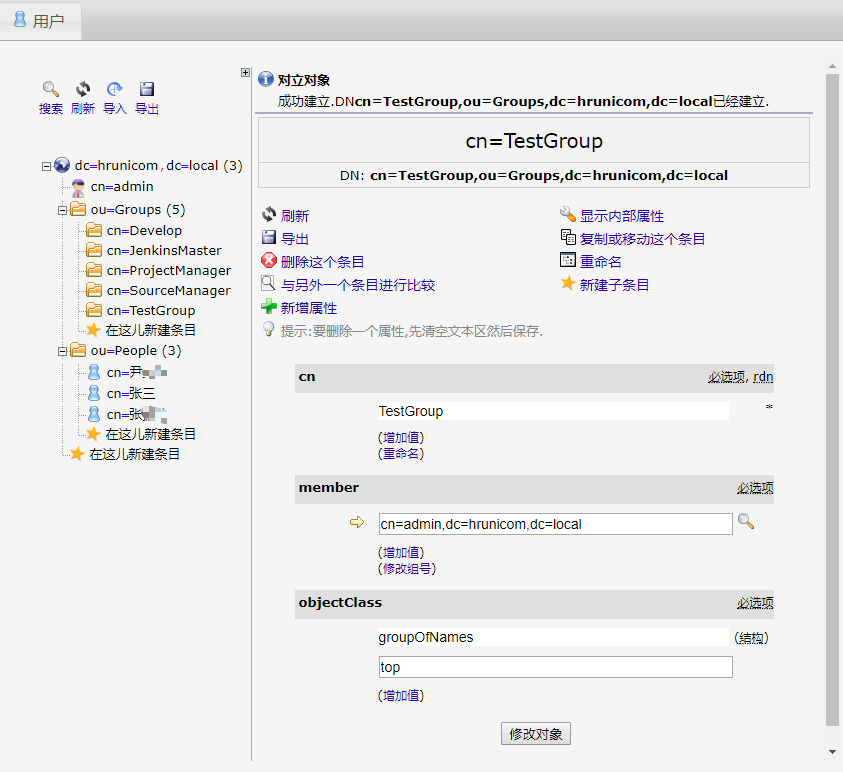

