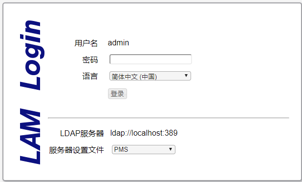
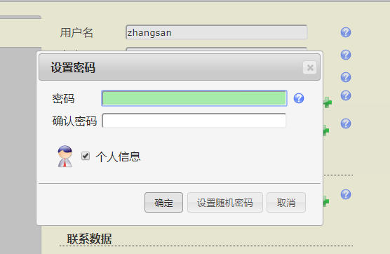
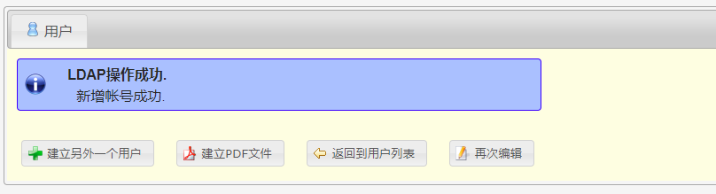
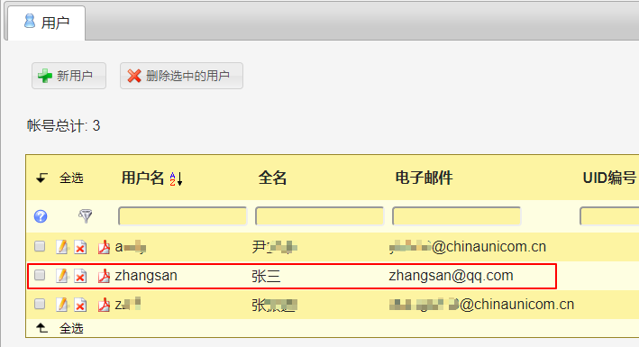
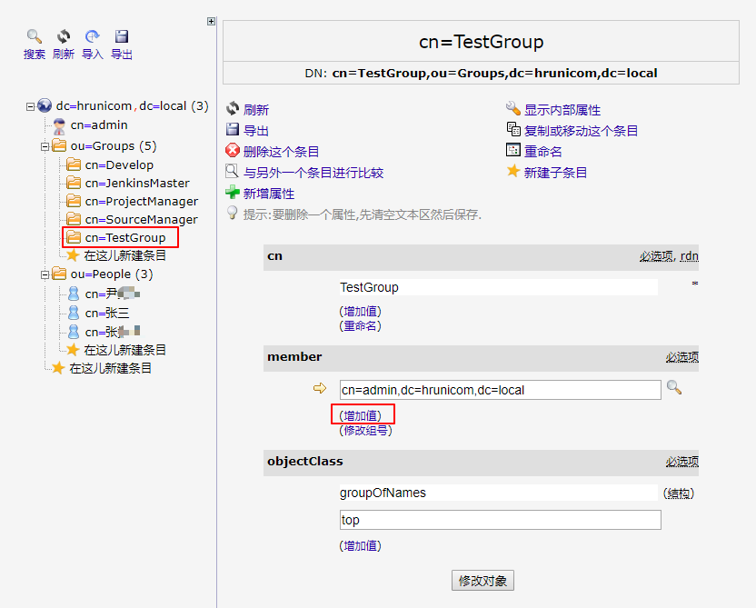
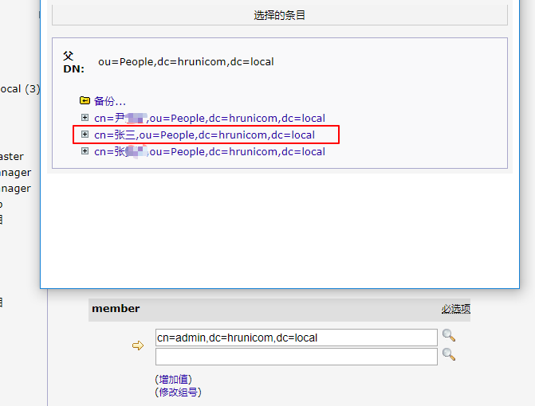
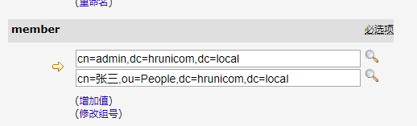
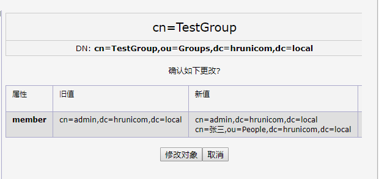
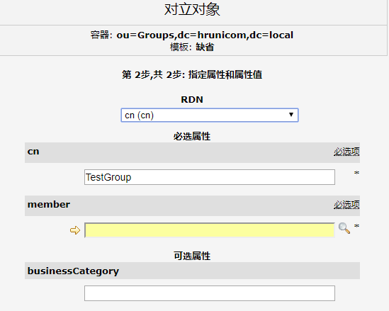
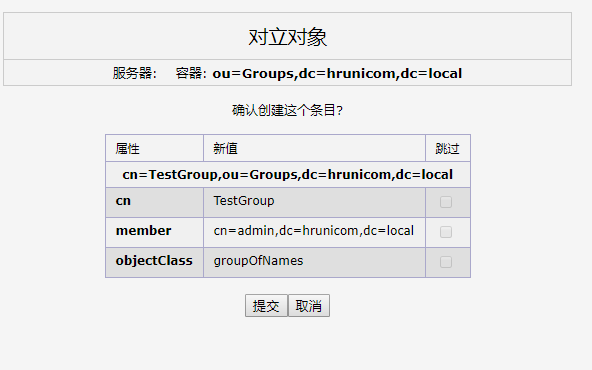

# LDAP服务器的管理

> 多个系统的整合采用LDAP集中管理账号，可以把它理解成一个读强写弱的文件类型数据库。为了让各个系统使用相同的账号密码信息，我们把账户信息保存在LDAP中，各系统均使用该LDAP进行登录验证。
>
> 因此整个环境中的账号管理一定要在LDAP中进行。这里采用LDAP Account Manager (LAM)来提供LDAP目录的web前端管理功能。
>
> 管理地址：http://10.12.110.122/ldap
>
> LDAP 根目录：`dc=hrunicom,dc=local `
>
> LDAP管理员账号：admin

**ou=Groups, dc=hrunicom, dc=local**

> 存放用户组的OU，各系统的账号权限识别就是基于这里的各个分组。
>
> SourceManager：源代码管理组，该组成员能够访问Gitlab系统。
>
> ProjetManager：项目管理组，该组成员能够访问Redmine项目管理系统。
>
> JenkinsMaster：持续集成主服务组，该组成员能够访问Jenkins的主服务器。

**ou=People, dc=hrunicom, dc=local**

> 存放用户账号信息。`用户账号`、`用户姓名` 和 `电子邮箱` 必须填写。

## 登录系统

访问网址：http://10.12.110.122/ldap

输入管理员密码进行登录。

进入系统后可看到目前的账号信息。

由于使用了LDAP的MemberOf功能，此界面下的用户管理无法对用户所属分组进行设置。

也可以使用树状结构查看信息。

## 新建用户

在用户界面点击`新用户` 按钮进行新建用户操作。**其中用户名、姓、名字、全名和电子邮件必须填写**。

*由于使用了LDAP的MemberOf功能，此界面下的用户管理无法对用户所属分组进行设置。*

可通过`设置密码` 按钮设置该用户密码，并通过`保存` 按钮存储信息。

返回用户页面，该用户已经存在。

##  账号设置分组

## 新建分组

点击`ou=People` 结构下的`在这儿新建条目` 。 

选择`缺省` ,