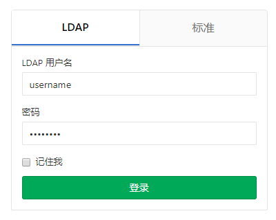
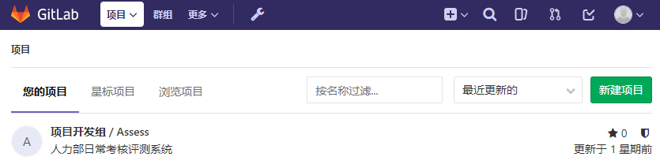

## 1. Gitlab基本使用操作

GitLab 是一个用于仓库管理系统的开源项目。使用[Git](http://baike.baidu.com/view/1531489.htm)作为代码管理工具，并在此基础上搭建起来的web服务。

可通过Web界面进行访问公开的或者私人项目。它拥有与Github类似的功能，能够浏览源代码，管理缺陷和注释。可以管理团队对仓库的访问，它非常易于浏览提交过的版本并提供一个文件历史库。团队成员可以利用内置的简单聊天程序(Wall)进行交流。它还提供一个代码片段收集功能可以轻松实现代码复用。

### Gitlab提供的功能 

* 代码托管服务
* 访问权限控制 
* 问题跟踪，bug的记录、跟踪和讨论 
* Wiki，项目中一些相关的说明和文档 
* 代码审查，可以查看、评论代码 

### Gitlab(Github)和Git区别 

​	Github和Git是两回事。 
​	Git是版本控制系统，Github是在线的基于Git的代码托管服务。 
​	GitLab 是一个用于仓库管理系统的开源项目。使用Git作为代码管理工具，可通过Web界面进行访问公开的或者私人项目. 

GitLab:  http://10.12.110.122/git/

> 登录时请选择LDAP方式进行验证。

登录成功后将显示你有权限访问的项目列表。

