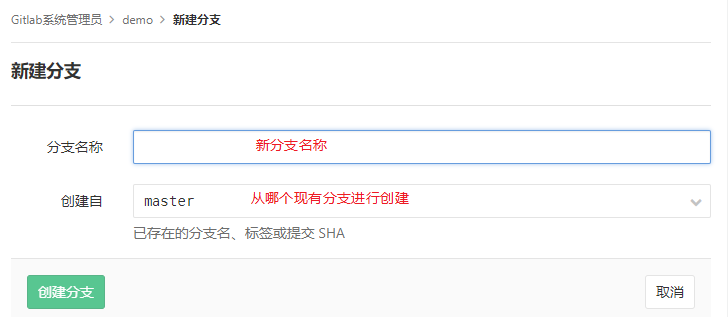

## 1.4 远程分支操作


[Git Flow工作流](../part1/git_flow.md)建议使用分支来进行多人协同工作。


主要分支:

- **(绿色)Master**: 永远处在 production-ready 状态
- **(橙色)Develop**: 最新的下次发布开发状态

支援性分支:

- **(蓝色)Feature**: 开发新功能都从 develop 分支出来，完成后 merge 回 develop
- **(黄色)Release**: 准备要 release 的版本，只修 bugs。从 develop 分支出来，完成后 merge 回 master 和 develop
- **(灰色)Hotfix**: 等不及 release 版本就必须马上修 master 赶上线的情况。会从 master 分支出来，完成后 merge 回 master 和 develop


### 1.4.1 创建远程分支

Git版本库允许创建分支，分支分为本地分支和远程分支。

> **本地分支**是一种临时分支，用户在Clone版本库到本地计算机后，在本地的版本库中建立分支并进行开发，完成开发后将该分支合并回本地版本库并提交到 Gitlab上去。此时该分支已没有作用可以删除。
>
> **远程分支**是指在Gitlab服务器版本库中建立的分支，可允许其他成员共享操作的分支。

当服务器版本库被初始化后（发生过一次commit并提交），在项目页面可看到各种功能按钮。


点击`+` 按钮，并选择新建分支。



输入分支名称，并选择从哪个分支进行创建，点击`创建分支` 按钮即可。


创建成功后可在项目的分支选择项中看到已经存在的分支。

使用Git命令实现：

```shell
git clone git@10.12.110.122:root/demo.git
cd demo
git checkout -b newBranch  //创建一个本地新分支并切换到新分支
git commit -am "newBranch is ready"
git push origin newBranch  //推送新分支到服务器
```

对于已经存在的远程分支可使用直接克隆到本地：

```shell
git clone -b <branch name> [remote repository address]
```

