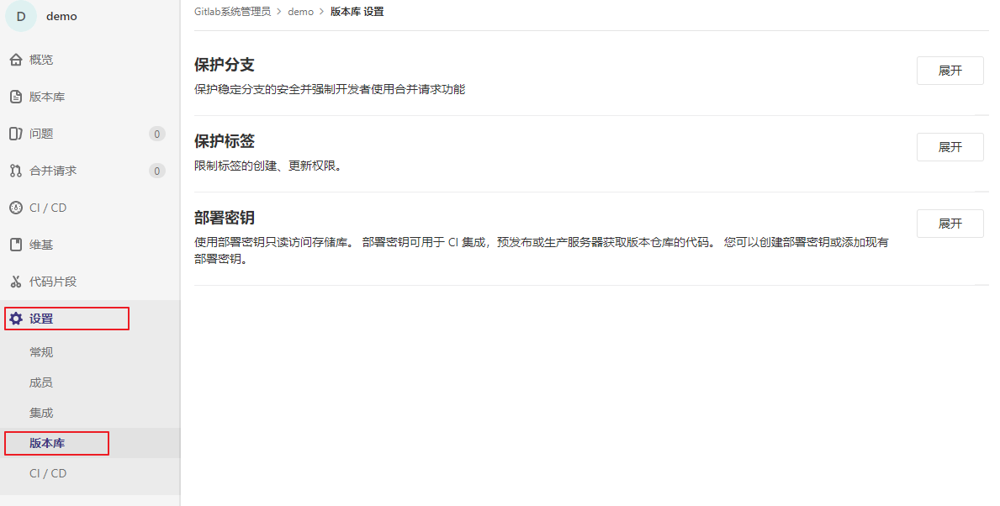

## 2.1 分支保护

>Gitlab具有对版本库和分支设置访问权限的功能，可以限制开发人员对版本库或者分支提交、更改和删除。

默认情况下，保护分支被设计为：

- 除了主程序员外(Master)，禁止其他所有人员创建分支
- 除了主程序员外(Master)，禁止其他所有人员推送
- 禁止**任何人** 强制推送此分支
- 禁止**任何人** 删除此分支

在Gitlab中找到你需要操作的项目。

在该项目页面的左侧导航菜单中选择“设置” -> "版本库"。

点击“保护分支”右侧的`展开` 按钮将显示分支保护设置项。

Beach:：需要保护的分支名称，可使用通配符。

Allowed to merge：允许合并到该分支的角色。

Allowed to push：允许提交到该分支的角色。

设置完成后，点击`保护` 按钮。

提交成功后将显示刚才设置的分支保护条目，此时develop分支只能主程序员有权限进行合并和提交操作。

Master分支是系统默认设置的。

取消分支保护直接点分支保护设置项后面的"Unprotect"即可。

在该项目页面的左侧导航菜单中选择“版本库” -> "分支"。该页面将显示该项目所有的远端分支。