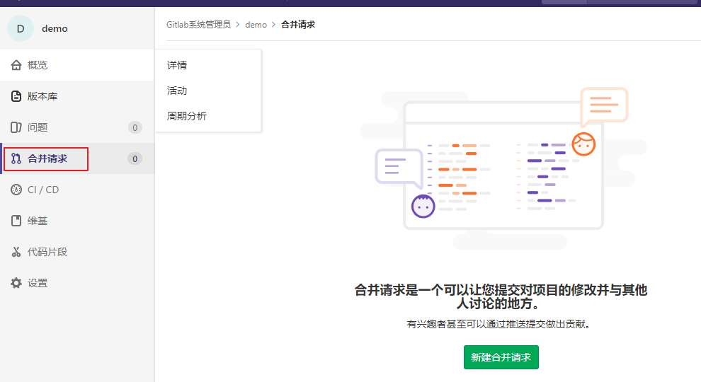
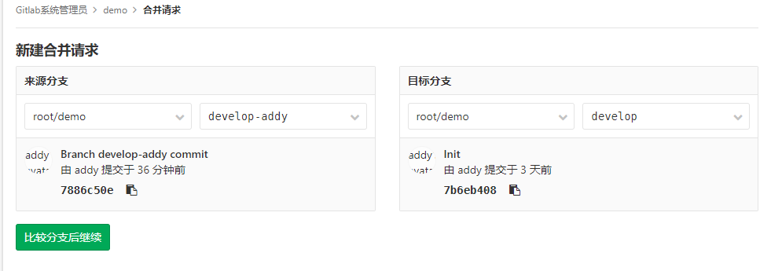
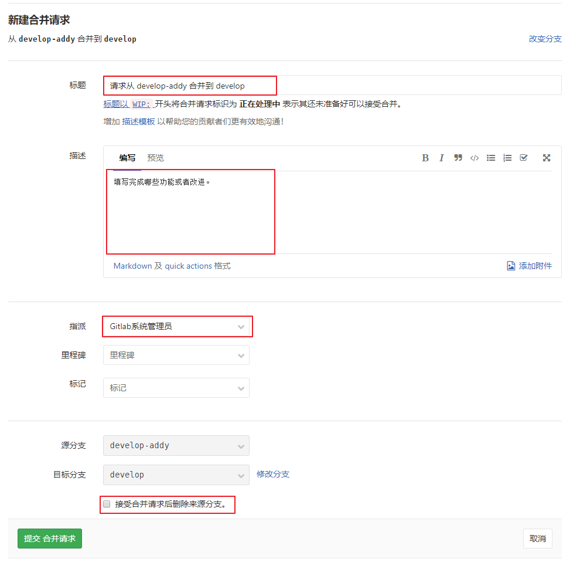
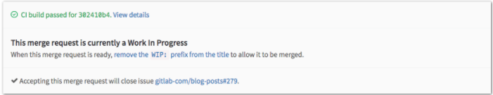
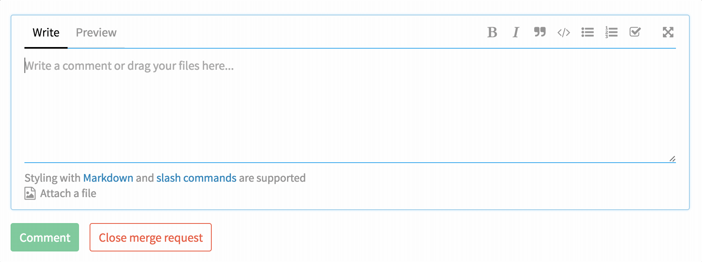
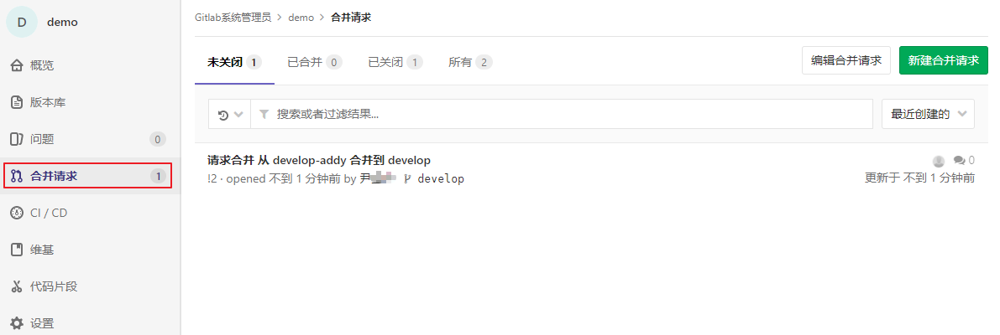
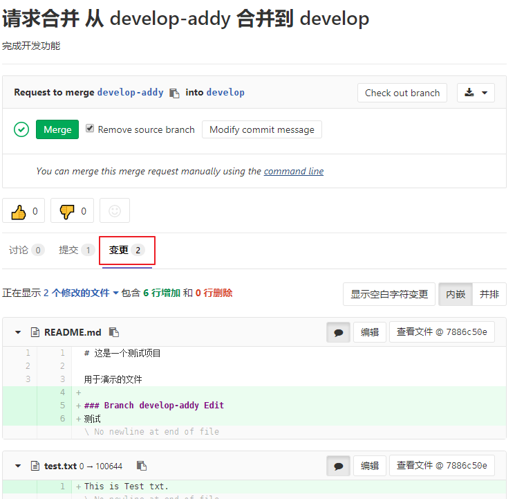
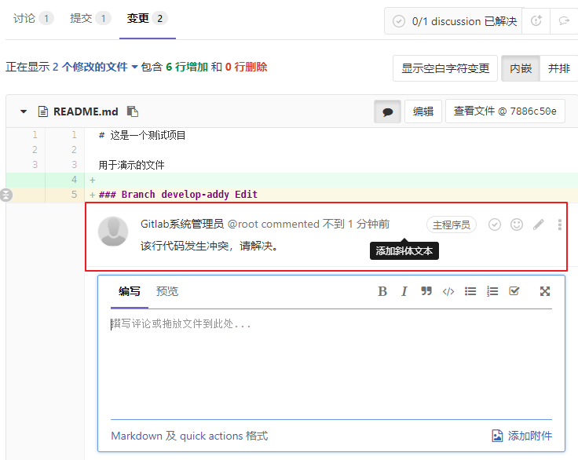
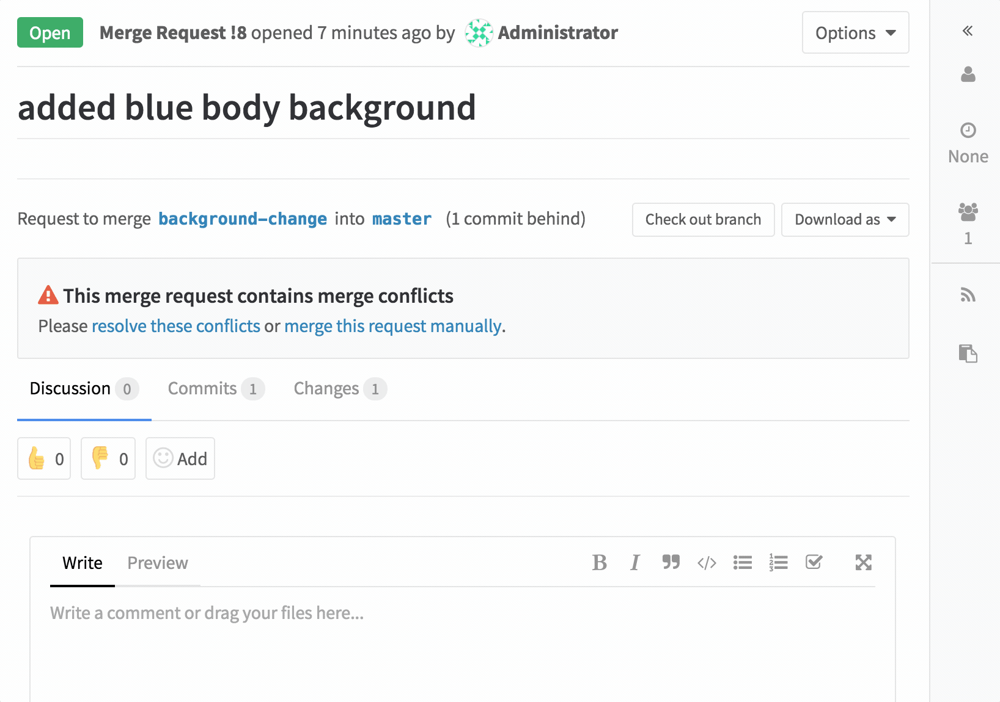
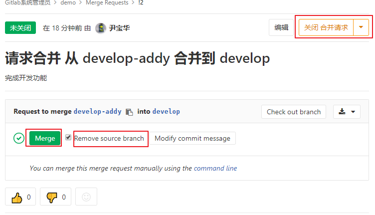

## 2.2 分支合并

>开发人员（Developer）在自己的开发分支完成开发任务后需要合并回开发分支（develop），由于开发分支为保护分支没有相应的权限，因此开发人员需要提交分支合并请求给管理员。管理员进行代码审核后，将该分支代码合并到开发分支（develop）。

在向管理员提交分支合并申请时，需要注意一下事项。

在完成了某模块的功能开发后，需要合并开发分支（develop-addy）到开发分支（develop），首先进行`git fetch --all` ，拉取远端最新的版本库库代码，并且在本地将开发分支（develop）的最新代码合并到本地自己的开发分支（develop-addy）上。如果发生冲突，则首先在本地解决冲突，并再次合并代码。本地合并成功后，将本地的开发分支（develop-addy）push 到Gitlab中。请求管理员把自己的仓库中的分支（develop-addy）合并到开发分支（develop），完成Pull Request工作流程。

### 2.2.1 发起合并请求

在项目页面选择左侧导航菜单中的”合并请求“，点击”新建合并请求“。

选择从`develop-addy` 分支合并到 `develop` 分支，并提交。

填写合并分支说明，描述清楚提交的理由，并指定哪个管理员进行合并处理操作。

另外如果是临时分支可选择`接受合并请求后删除来源分支` ，表示合并成功后将删除该分支。

#### WIP MR

WIP MR 含义是 **在工作过程中的合并请求**，是一个我们在 GitLab 中避免 MR 在准备就绪前被合并的技术。只需要添加 `WIP:` 在 MR 的标题开头，它将不会被合并，除非你把 `WIP:` 删除。

当你改动已经准备好被合并，编辑工单来手动删除 `WIP:` ，或者使用就像如下 MR 描述下方的快捷方式。

**新功能：** `WIP` 模式可以通过[斜线命令](https://docs.gitlab.com/ce/user/project/slash_commands.html)[29] `/wip` [快速添加到合并请求中](https://about.gitlab.com/2016/10/22/gitlab-8-13-released/#wip-slash-command)[30]。只需要在评论或者 MR 描述中输入它并提交即可。

### 2.2.2 审核合并请求 

此时你所指定的管理员在登陆系统后将能看到该分支合并请求。该管理员就需要进行代码审核操作，确保合并不会产生冲突。在审核过程中如果发现问题可以通过讨论功能与提交者进行沟通和更改。

点击该合并请求后将显示详细信息。通过`变更` 项可查看合并内容的不同。

并且可以对代码进行基于行的注释和评论反馈给提交者。

可以快速地[通过图形界面来解决](https://about.gitlab.com/2016/08/22/gitlab-8-11-released/#merge-conflict-resolution)[31]，或者依据你的需要修改文件来修复冲突。

### 2.2.3 处理合并请求

管理员代码审核通过后，进行相应的处理操作。

**关闭：**对于完全不合格的代码或者废弃的分支的合并请求，点击右上角的`关闭合并请求` 。合并请求将被关闭，相当于扔进回收站。

**改进：**对于分支内需改进的代码，开发人员（Developer） 直接修正并推送即可，合并请求将会自动包含最新的推送提交。

**接受：**管理员审查无误后，可以接受该次合并请求。点击`Merge` 按钮系统将自动合并分支。如果勾选`Remove source-branch` ，系统在合并后将删除源分支。

