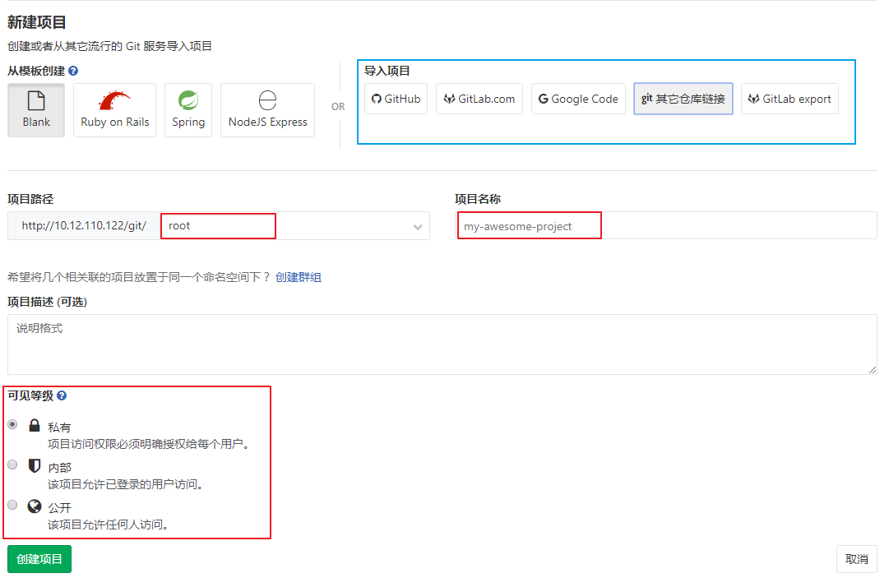
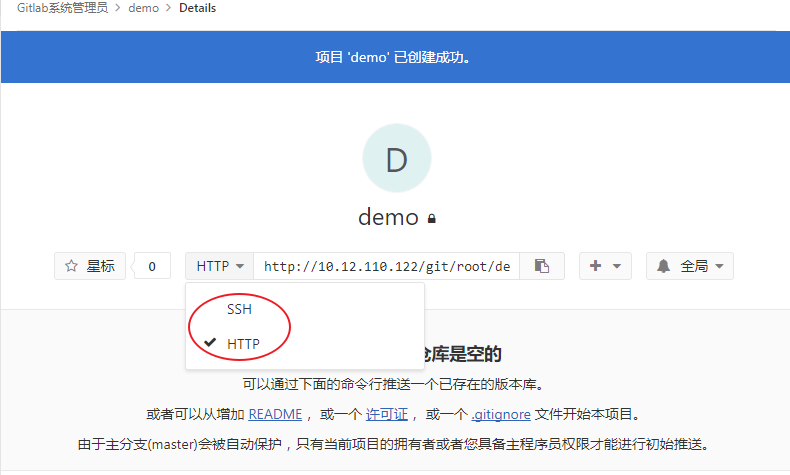

## 1.1 创建项目

登录gitlab成功后，点击右侧导航条上的 “+” 并选择`新建项目` 就可以进入创建项目的页面。

在创建工程的页面，按照要求填写项目的名称和可见性等信息。

**导入项目**：如需将其他地方的版本库迁移到Gitlab中来，可以使用该功能填写原有版本库地址，系统将自动导入。

**项目路径**：每个项目必须指定属于某个用户还是属于某个组的。 如果这个项目属于用户，那么这个拥有者对所有可以获取这个项目的人拥有直接管理权；如果这个项目属于一个组，那么该组中用户级别的权限也会起作用。

**项目名称**：项目的唯一标识。

**项目描述**：可选项，对项目的简单文字描述

**可见级别**：提供Private（私有的，只有你自己或者组内的成员能访问）/Internal（所有登录的用户）/Public(公开的，所有人都可以访问)三种选项。

输入项目名称并选择可见等级后点击`创建项目` 。

在系统中创建的项目可以使用HTTP协议访问也可使用SSH协议访问。

要启用SSH协议访问版本库需要用户已经添加了SSH的公钥才可以。

> 我们创建的Root用户下的demo项目访问地址如下：
>
> HTTP:    http://10.12.110.122/git/root/demo.git
>
> SSH : 	git@10.12.110.122:root/demo.git

项目创建成功后就可以通过 Git命令或者Git客户端进行访问和操作，具体内容请参考[Git的使用](part1/git_use.md) 。

*注意： Gitlab默认策略主自动保护分支(master)，只有当前项目的拥有者或者具备主程序员权限才能进行初始推送。*

