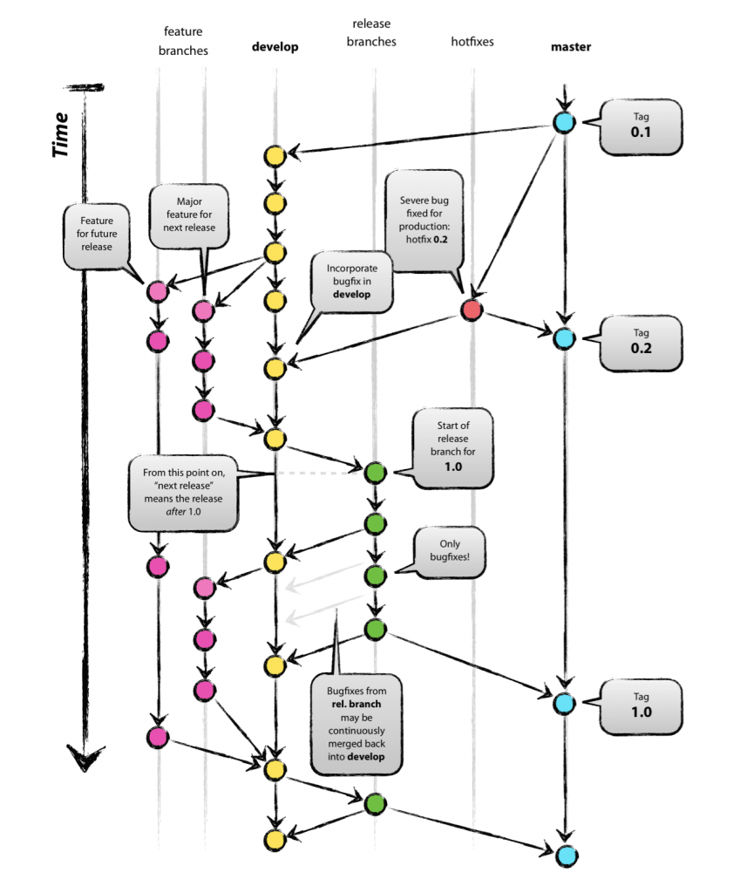
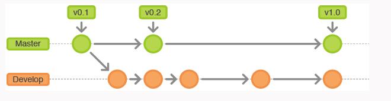
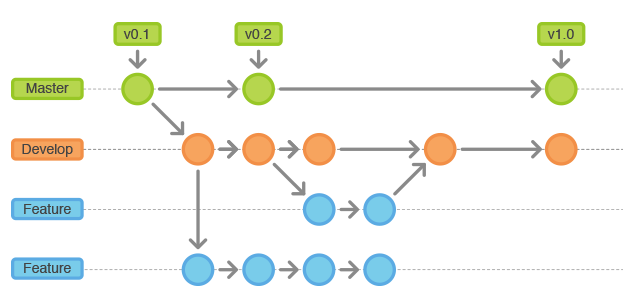
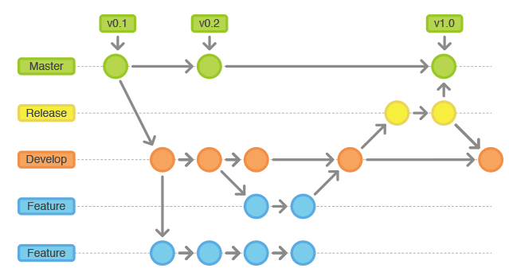
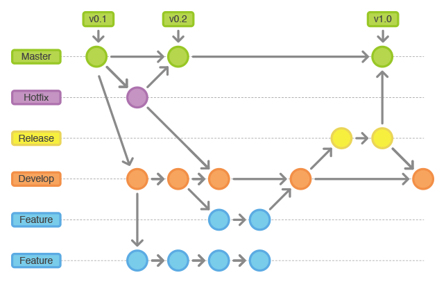
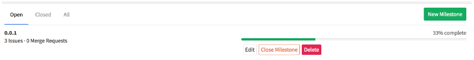
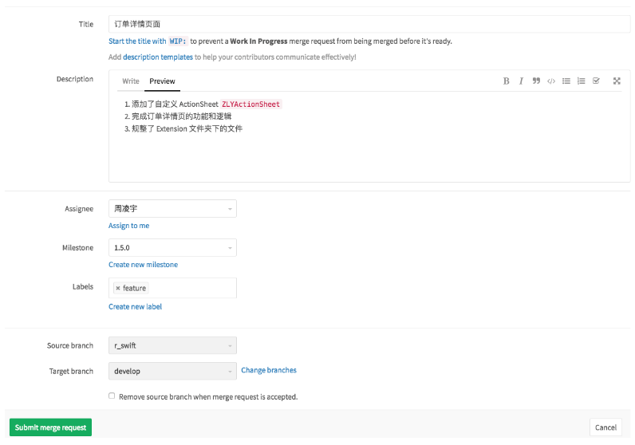
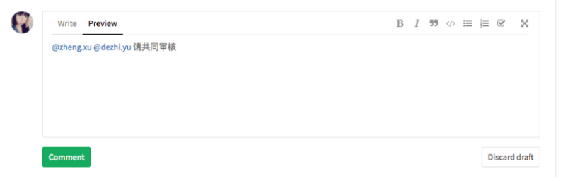
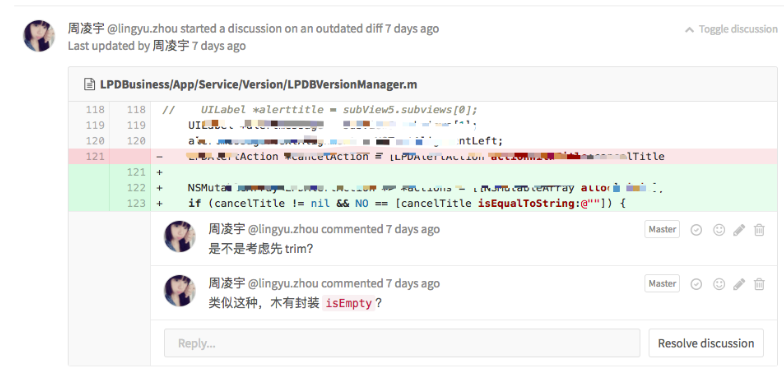
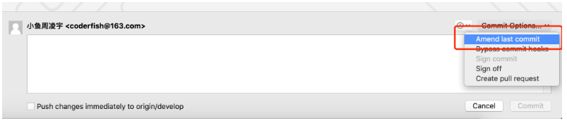

## 2.4 实现工作流

**工作流** 是在软件开发过程中，在使用 GitLab 作为代码托管平台时，可以采取的动作的一个逻辑序列。统一的工作流程是至关重要的，不管对于哪一个行业的作业来说都一样。对于我们开发人员，工作流包含了开发时 Git 的使用规范、Repo 管理的规范、测试过程的规范、设计交互的管理规范等等。



**分支管理对于 Git 的贡献，那是众所周知的。在上图中提到的工作流中所使用的分支主要有一下几种：**

- 主要分支
  - `master` : 长期分支，一般用于管理对外发布版本，每个 commit 对一个 tag，也就是一个发布版本
  - `develop` : 长期分支，一般用于作为日常开发汇总，即开发版的代码
- 支援性分支
  - `feature` : 短期分支，一般用于新功能的开发，完成后 merge 回 `develop` 
  - `release` : 短期分支，一般用于发布正式版本之前（即合并到 `master` 分支之前），需要有的预发布的版本进行测试。`release` 分支在经历测试之后，测试确认验收，将会被合并的 `develop` 和 `master`
  - `hotfix` : 短期分支 ，一般用于正式发布以后，出现 bug，需要创建一个分支，进行 bug 修补。会从 `master`分支出来，完成后 merge 回 `develop` 和 `master`


我们首先熟悉了一下可能存在的各种分支，以及每种分支都能做些什么？接下来，我们就来看看如何在我们的项目中让这几种分支完美协作。接下来我会使用 SourceTree 来操作。

### 2.4.1 工作方式

Gitflow工作流使用2个分支来记录项目的历史。master分支存储了正式发布的历史，而develop分支作为功能的集成分支。 这样也方便master分支上的所有提交分配一个版本号。

- Master(绿色): 永远处在产品发布状态，每次Commit都使用Tag标记版本。
- Develop(橙色): 最新的下次发布开发状态，日常开发汇总。




**功能分支Feature:**  短期分支

分支名 feature/*

每个新功能位于一个自己的分支，这样可以push到中央仓库以备份和协作。 但功能分支不是从master分支上拉出新分支，而是使用develop分支作为父分支。当新功能完成时，合并回develop分支，合并完分支后一般会删点这个Feature分支，但是我们也可以保留。 新功能提交应该从不直接与master分支交互;




**发布分支Release: ** 短期分支

一旦develop分支上有了做一次发布（或者说快到了既定的发布日）的足够功能，就从develop分支上fork一个发布分支。 新建的分支用于开始发布循环，所以从这个时间点开始之后新的功能不能再加到这个分支上—— 这个分支只应该做Bug修复、文档生成和其它面向发布任务。 一旦对外发布的工作都完成了，发布分支合并到master分支并分配一个版本号打好Tag。 另外，这些从新建发布分支以来的做的修改要合并回develop分支;

发布Release分支时，合并Release到Master和Develop， 同时在Master分支上打个Tag记住Release版本号，然后可以删除Release分支了。


**维护分支 Hotfix：**短期分支

分支名 hotfix/*

维护分支或说是热修复（hotfix）分支用于生成快速给产品发布版（production releases）打补丁，这是唯一可以直接从master分支fork出来的分支。 修复完成，修改应该马上合并回master分支和develop分支（当前的发布分支）,master分支应该用新的版本号打好Tag。为Bug修复使用专门分支，让团队可以处理掉问题而不用打断其它工作或是等待下一个发布循环。 你可以把维护分支想成是一个直接在master分支上处理的临时发布;


### 2.4.2 Git操作规范

Git 每次提交代码，都要写 Commit message（提交说明），否则就不允许提交。长期使用良好规范的提交说明，可直接从Commit生成Change log。

1. `commit message` 言简意赅，不要写无用信息。不要出现 『update』，『Bug Fix』，这样让别人不能领其意的描述
2. 添加一个新的 `Pod` 库或 `pod update` 后，单独提交一个 `commit`，统一 `commit message` 为『pod add xxx』或 『pod update』
3. `commit` 之间保持独立，不要有修改同一个文件的情况。比如一个 `Pull Request` 中 commit1 在 FileA 中改了一个变量名， commit2 改回了变量名。原因是：**审核代码时，审核人通常会逐个 commit查看，而不是直接看 Changes（可以直接忽略掉 pod update 这样的 commit 不看）**

目前，社区有多种 Commit message 的写法规范。[Angular 规范](https://docs.google.com/document/d/1QrDFcIiPjSLDn3EL15IJygNPiHORgU1_OOAqWjiDU5Y/edit#heading=h.greljkmo14y0)是目前使用最广的写法，比较合理和系统化，并且有配套的工具。


**Commit message 的格式**

每次提交，Commit message 都包括三个部分：header，body 和 footer。

```
<type>(<scope>): <subject>
<BLANK LINE>
<body>
<BLANK LINE>
<footer>
```

其中，header 是必需的，body 和 footer 可以省略。
不管是哪一个部分，任何一行都不得超过72个字符（或100个字符）。这是为了避免自动换行影响美观。

#### Header

Header部分只有一行，包括三个字段：`type`（必需）、`scope`（可选）和`subject`（必需）。

##### type

用于说明 commit 的类别，只允许使用下面7个标识。

- feat：新功能（feature）
- fix：修补bug
- docs：文档（documentation）
- style： 格式（不影响代码运行的变动）
- refactor：重构（即不是新增功能，也不是修改bug的代码变动）
- test：增加测试
- chore：构建过程或辅助工具的变动

如果type为`feat`和`fix`，则该 commit 将肯定出现在 Change log 之中。其他情况（`docs`、`chore`、`style`、`refactor`、`test`）由你决定，要不要放入 Change log，建议是不要。

##### scope

scope用于说明 commit 影响的范围，比如数据层、控制层、视图层等等，视项目不同而不同。

例如在`Angular`，可以是`$location`, `$browser`, `$compile`, `$rootScope`, `ngHref`, `ngClick`, `ngView`等。

如果你的修改影响了不止一个`scope`，你可以使用`*`代替。

##### subject

`subject`是 commit 目的的简短描述，不超过50个字符。

其他注意事项：

- 以动词开头，使用第一人称现在时，比如change，而不是changed或changes
- 第一个字母小写
- 结尾不加句号（.）

#### Body

Body 部分是对本次 commit 的详细描述，可以分成多行。下面是一个范例。

```
More detailed explanatory text, if necessary.  Wrap it to 
about 72 characters or so. 

Further paragraphs come after blank lines.

- Bullet points are okay, too
- Use a hanging indent
```

有两个注意点:

- 使用第一人称现在时，比如使用change而不是changed或changes。
- 永远别忘了第2行是空行
- 应该说明代码变动的动机，以及与以前行为的对比。

#### Footer

Footer 部分只用于以下两种情况：

##### 不兼容变动

如果当前代码与上一个版本不兼容，则 Footer 部分以BREAKING CHANGE开头，后面是对变动的描述、以及变动理由和迁移方法。

```
BREAKING CHANGE: isolate scope bindings definition has changed.

    To migrate the code follow the example below:

    Before:

    scope: {
      myAttr: 'attribute',
    }

    After:

    scope: {
      myAttr: '@',
    }

    The removed `inject` wasn't generaly useful for directives so there should be no code using it.
```

#### 关闭 Issue

如果当前 commit 针对某个issue，那么可以在 Footer 部分关闭这个 issue 。

```
Closes #234
```

#### Revert

还有一种特殊情况，如果当前 commit 用于撤销以前的 commit，则必须以revert:开头，后面跟着被撤销 Commit 的 Header。

```
revert: feat(pencil): add 'graphiteWidth' option

This reverts commit 667ecc1654a317a13331b17617d973392f415f02.
```

Body部分的格式是固定的，必须写成`This reverts commit &lt;hash>`.，其中的hash是被撤销 commit 的 SHA 标识符。

如果当前 commit 与被撤销的 commit，在同一个发布（release）里面，那么它们都不会出现在 Change log 里面。如果两者在不同的发布，那么当前 commit，会出现在 Change log 的Reverts小标题下面。


### 2.4.3 管理规范

### Milestones

`Milestones` 即里程碑，`issue` 在建立的时候可以选择 `Milestones`，如果合理的使用了 `Milestones`，在 Milestones 页面，就可以得到一个清晰的项目进度。



### Pull Request

所有的合并都需要提 `Pull Request`，包括自己的分支合并到自己的分支，可以更好的帮助大家养成 Code Review 的好习惯。

`Pull Request` 的标题应该简介的介绍该次合并所做的事。更详细的内容应当在 `Description` 中逐条列出。如有相关文档链接也应列出。



注意选择合适的 `Milestone` 和 `Labels`。选择一位 Assignee 来审核，如果觉得该 `Pull Request` 内容过多，或有需要大家共同讨论的地方，再 `Pull Request` 提交后，在 `Discussion` 区域 `@` 其他人，所有人都会及时收到邮件。



### Code Review

`Code Review` 是一个很值得说的点。很多时候大家会以为 `Code Review` 是一定要读懂别人的代码，然后进行分析、审核。其实 `Code Review` 更多的是扮演了团队内经验传递的作用。

举个例子，代码规范这样的东西，就算是一个团队有了很详细的文档，但大家也不一定会去完整记下。对于新人，完成了 feature 后提 `Pull Request`，交由其他人 `Code Review` 时，由其他人审核代码规范，不合规要求继续修正，来回四五次，就再基本不会有问题了。

这也是我的亲身经历，我之前的一位 leader 对于 Work Flow 管理非常有经验，我在最初时提了几次 `Pull Request`，很快就熟悉了团队内的代码规范。

所以 `Code Review` 审核人应当检查的内容不是硬性的，但至少应当包括：

1. 代码规范
2. 基本语法和基本逻辑错误
3. 业务逻辑的一些经验
4. …

在发现错误时，应当及时的添加 `comment`。



当审核人全部审核完毕，添加完所有的 `comment` 之后需要在 `Discussion` 区域 `@提交人 review done`，通知提交人。

同样，提交人在按照 `comment` 修改完后，也应当在 `Discussion` 区域 `@相关审核人 修改完成，请重新审核`。

需要着重说明的是：提交人的**所有修改，不允许新提交 commit**，应当在本地修改完成后，`ammend` 追加到最后 `commit`。



但是这一点，只是我一直使用的方式，原因同样是遵循『`commit` 之间保持独立』，如果提交新的 `commit` 导致两个 `commit` 修改了同一个文件。