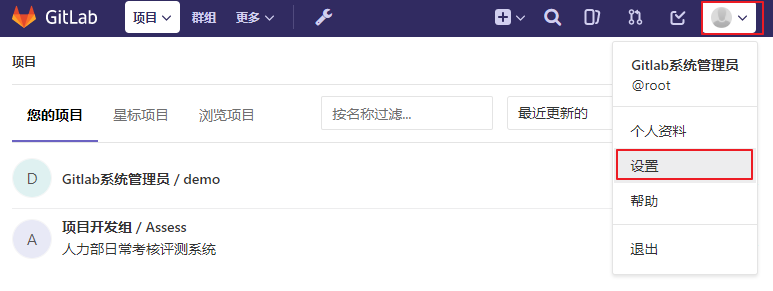
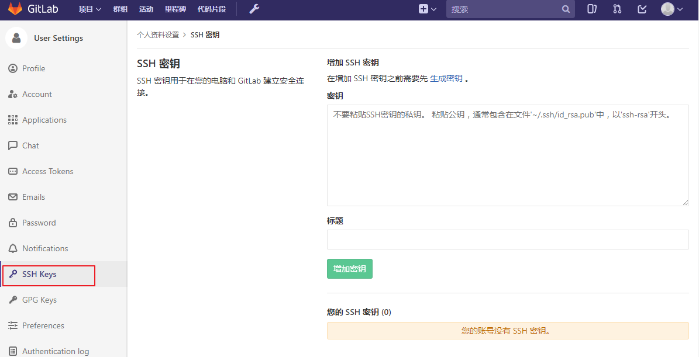
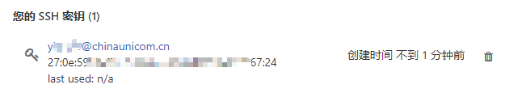

## 1.2 连接到项目

Gitlab 同时支持 SSH 和 HTTP 的方式访问，SSH 方式更加快速和安全并且可以避免输入密码的麻烦。

Gitlab开启SSH方式访问的前提是需要上传你本地账户的SSH公钥。SSH Key的生成请参考 [Git的安装](part1/git_install.md) 章节，这里不再重述。

找到你的公钥文件，一般为`~/.ssh/id_rsa.pub` ，复制文件中的所有内容。




点击页面右上角用户头像，选择设置。




左侧菜单选择 SSH Keys，显示添加密钥页面。 

将公钥文件id_rsa.pub中的所以内容粘贴到`密钥·` 输入框中，并设置一个便于区分的标题名称，点击增加密钥按钮提交。




至此你就可以用Git命令初始化版本库。

```bash
git clone git@10.12.110.122:root/demo.git
cd demo
touch README.md
git add README.md
git commit -m "add README"
git push -u origin master
```
如果项目存在需要导入到gitlab可以直接将项目导入上去

```bash
cd existing_folder
git init
git remote add origin git@10.12.110.122:root/demo.git
git push -u origin master
```