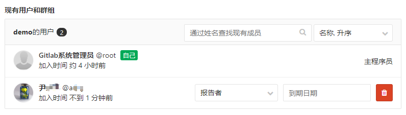

## 1.3 角色和权限

> 一个项目如果需要团队或者多个人共同开发则需要将所有参与人员添加到该项目的成员中，并根据每个人的职责分配不同的角色权限。

首先来了解下，Gitlab系统中的五种角色：

| 角色        | 描述    |
| --------- | ----- |
| Owner     | 项目拥有者 |
| Master    | 主程序员  |
| Developer | 开发人员  |
| Reporter  | 报告者   |
| Guest     | 访客    |

更详细的权限说请参阅[GitLab角色权限](http://10.12.110.122/git/help/user/permissions) 。

一般来说项目的管理者设置为主程序员角色，其具有对受保护的主分支Master更新操作的权限。

其他参与的开发人员设置为开发人员角色，其无法直接对主分支Master进行更新。开发人员需要首先从主分支Master上建立一个新的开发分支，并且所有的开发均在这个新建的分支上进行。完成开发后，需要请求主程序进行合并分支操作，将开发分支的代码合并到主分支Master上。

Gitlab中首先进入你需要操作的项目页面。

点击左侧菜单`设置` ，并选择`成员` 功能。

> 填加项目成员有两种方式：
>
> 用户模式：针对每个用户账号进行角色设置。
>
> 群组模式：针对已存在的群组中所有用户进行角色设置。

### 群组模式

选择群组名称，而后设置`权限级别` ，这样该群组中所有用户将在该项目中具有所设置的角色权限。

### 用户模式

选择要添加的用户并设置角色权限即可。

这样所有添加进来的用户

我们需要做的是，为项目成员分配恰当的角色，以限制其权限。

# 锁定受保护分支

在对 Git 不熟悉的时候，时常苦恼于各个分支不受约束，任何开发人员都可以向任何分支直接推送任何提交，各种未经审查的代码、花样百出的 Bug 就这样流窜在预发布分支上。

其实我们可以通过 GitLab 的**受保护分支（Protected Branches）**功能解决该问题，该功能可用于：

- 阻止 Master 角色以外的开发人员直接向此类分支推送代码，保持稳定分支的安全性；
- 在向受保护分支合并代码前，强制进行代码审查。

接下来我们就使用这项功能，锁定我们的受保护分支——主分支 `master` 和预发布分支 `release-*`，以阻止 Developer 直接向这两类分支中推送代码：

Git 受保护分支

锁定后，Developer 推送代码将会报错：

`1``$ git push origin master
Counting objects: 4, done.
Delta compression using up to 4 threads.
Compressing objects: 100% (2/2), done.
Writing objects: 100% (3/3), 283 bytes | 0 bytes/s, done.
Total 3 (delta 1), reused 1 (delta 0)
remote: GitLab: You are not allowed to access master!
remote: error: hook declined to update refs/heads/master
To git@website:project.git
 ! [remote rejected] master -> master (hook declined)
error: failed to push some refs to 'git@website:project.git'`

# 发起合并请求

锁定受保护分支后，要么 Master 需要时刻、主动关注各特性分支的进度，要么 Developer 需要线下、口头向 Master 汇报其特性分支的进度，这两种做法都非常不便于 Master 管理每个预发布分支的合并，尤其在团队大、分支多的情况。

我们可以通过 GitLab 的**发起合并请求（Merge Request）**功能解决该问题，这样既可以让 Developer 更自如的掌控自己分支进度，在必要的时候才主动发起合并请求；又可以减轻 Master 的合并工作量和沟通成本，可谓一举两得。

## 新建合并请求

第一步，按表单要求填写合并请求。注意，对于 Developer 而言：

- `From` 是你的特性分支 `feature-*`；
- `To` 只可能是预发布分支 `release-*`；
- `Title` 和 `Description` 要填写恰当的分支描述；
- `Assign to` 是该项目的 Master。

新建合并请求

## 审查合并请求

第二步，Master 收到合并请求后，进行代码审查。逐一查看 `Commits` 一栏提交的内容即可，对于需要改进的代码，可以直接在该行添加注释，非常方便。

接受合并请求

如果对整个请求还有疑问的地方，还可以通过底部的 `Discussion` 功能进行线上讨论。

## 处理合并请求

第三步，针对审查结果进行相应处理：

### 关闭

对于完全不合格的垃圾代码、或者废弃的特性分支的合并请求，Master 点击右上角的 `Close` 按钮即可。合并请求将被关闭，相当于扔进回收站。

### 改进

对于分支内需改进的代码，Developer 直接修正并推送即可，合并请求将会自动包含最新的推送提交。

### 接受

Master 审查无误后，可以接受该次合并请求。点击 `Accept Merge Request` 按钮将自动合并分支，勾选 `Remove source-branch` 将同时删除该特性分支。

整个自动合并过程如果以命令形式手工执行的话，步骤如下：

`12345678``#Step 1. Update the repo and checkout the branch we are going to merge git fetch origingit checkout -b test origin/feature-test#Step 2. Merge the branch and push the changes to GitLab git checkout release-2016.4.7git merge --no-ff feature-testgit push origin release-2016.4.7`

以[非快进式合并](http://www.cnblog.me/2015/08/17/git-merge/#非快进式合并)完成后，祖先图谱（graph）的展现结果如下：

`1``*   be512fa (HEAD, origin/release-2016.4.7, release-2016.4.7)  Merge branch 'test' into 'release-2016.4.7'
|| * 1f52adf 测试
|/
\*   a4febbb (tag: 1.0.0, origin/master) 格式化货币保留两位小数`

最后需要注意的是，只有 `Assignee` 才能够接受合并请求，其它人只会被通知：

# 问题

事情是这样的，最近跟几位同事搞一些东西，打算在Gitlab上建一个仓库，然后协同开发。

我建好仓库，将其他几位同事添加进来，角色分配为Develop。

 

之后提交初始代码到master分支后，他们用sourceTree拉取代码后进行开发，之后再提交时发现**无法提交**，提示**没有权限**。

如下：

> 错误提示：
>
> git -c diff.mnemonicprefix=false -c core.quotepath=false push -v origin master:master
> Pushing to <http://xxx/xxx/xxx_HTML.git>
>
> POST git-receive-pack (47642 bytes)
>
> remote: **GitLab: You don‘t have permission**[K
>
> To <http://xxx/xxx/xxx_HTML.git>
> ! [remote rejected] master -> master (pre-receive hook declined)
> error: failed to push some refs to ‘http://xxx/xxx/xxx_HTML.git‘

 

# 解决方案

研究了下Gitlab，最终解决方案是：

在项目的【Setting】中的【Protected branches】可以设置哪些分支是被保护的，默认情况下【master】分支是处于被保护状态下的，develop角色的人是无法提交到master分支的，在下面的【Developers can push】打上钩就可以了。

