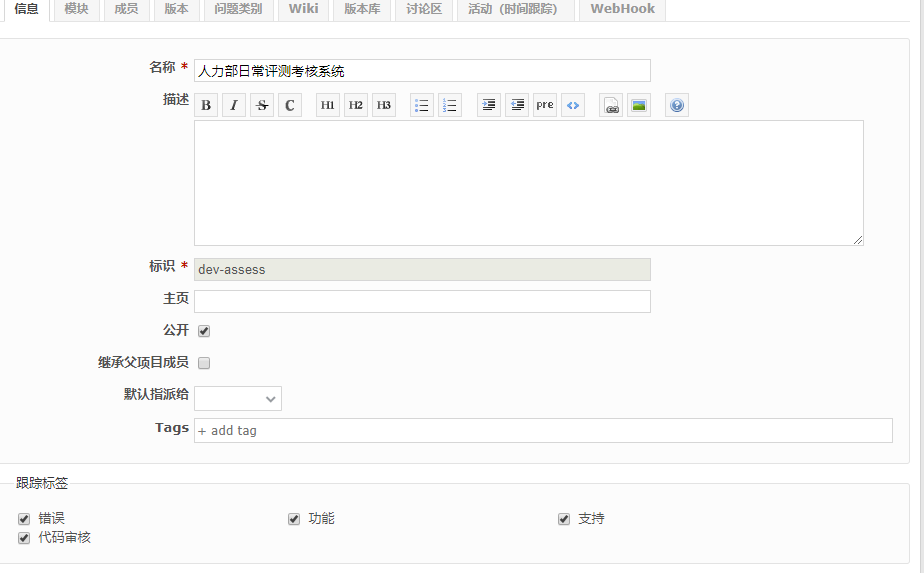
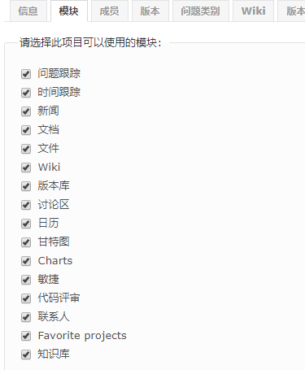
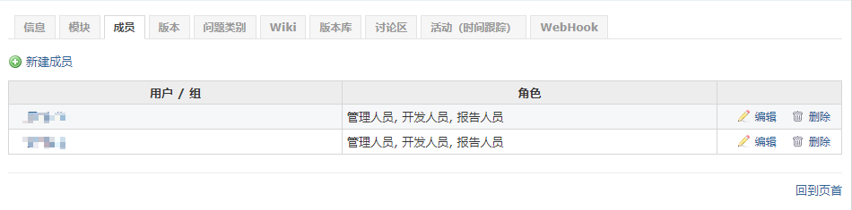
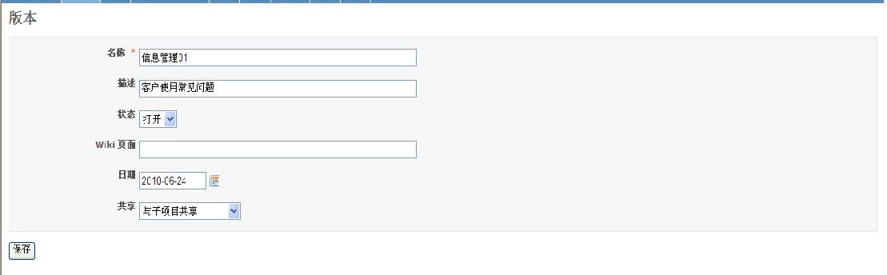
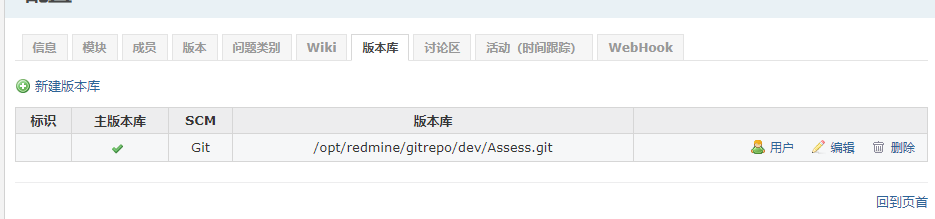

## 4. 项目配置

此功能对项目实施具体的，全面的配置。

### 4.1 信息

在这里可以设置

- 项目名称

- 上级项目

  指定该项目的父项目，并且可以无限嵌套。

- 项目描述

- 标识

  由于Redmine支持多项目, 而且采用REST架构, 所以需要一个URL的唯一标识符。 这个值在创建项目时填写, 且一旦创建成功就不能修改。

- 主页

  主页链接会显示在项目概述页面中

- 是否公开

  如果选中, 该项目将允许所有用户浏览, 包括非项目成员的用户。

  如果不选, 只有项目成员才有权限访问。

- 跟踪标签

  在这里可以设置开启哪些跟踪标签, 默认可用的有三种: 错误, 功能和支持。

  管理员可以在管理界面添加跟踪标签的类型。

### 4.2 模块 

该项目开启的功能模块

### 4.3 成员

指定项目的成员, 以及他们的角色。可以以组为操作单元, 给组赋予角色, 添加到项目中。 这样该组的所有成员都成为该项目的成员, 且属于相同的角色, 拥有一样的权限。

### 4.4 版本

项目版本可以对变更进行跟踪和计划。 你可以给问题指定目标版本, 然后在路线图中就能看到与改版本关联的问题列表。

版本包括的属性:

- 名称
- 描述
- 状态：状态控制问题如何被指定目标版本。
  - 打开：默认值, 没有限制
  - 锁定：不能再给该版本指定新的问题
  - 关闭：不能再给该版本指定新的问题, 而且不能重新打开已经指定目标版本的问题。

- Wiki页面

  可以将该版本的主要事件写入Wiki里, 以供浏览该版本时显示 *可选属性* 。

- 日期

  版本的完成日期 *可选属性*

- 共享

  这个属性是Redmine-0.9添加的, 该属性决定该版本是否能被其他项目共享, 从而使其他项目的问题也可以指定到该版本 *可选属性* 。

  - 不共享

  - 与子项目共享

    所有子孙项目

  - 与项目继承层次共享

    祖先以及子孙项目

  - 与项目树共享

    根项目和所有子孙项目(与上面的等同)

  - 与所有项目共享

  私有项目与公开项目共享版本后, 私有项目的名称将能够别所有用户看到。

  在版本列表页面点击"关闭已完成的版本"链接, 那些处于完成状态的版本(到达截至日期并且没有处于打开状态的问题)将自动关闭。

### 4.5 问题类别

问题类别功能可以有效组织管理项目的问题。

问题类别的属性:

- 名字 *必填字段*

- 指派给

  新建属于该类别的问题将自动指派给该项目成员 *可选字段* 。

### 4.6 Wiki

每一个项目拥有它自己的wiki。

### 4.7 版本库

每一个项目能跟一个版本库(SCM)建立关联。 一旦版本库配置成功, 你就可以点击"版本库"选项卡, 浏览版本库的变更集了。 版本库的变更集也能在活动页面浏览到。

### 4.8 讨论区

每一个项目可以有一个或者多个讨论区。 讨论区的属性有:

- 名称
- 描述

### 4.9 活动 

默认情况下, 活动阶段有"开发"和"测试"两种类型, 管理员可以根据需要创建新的活动阶段。

只有选中的活动阶段才会出现在登记工时页面的下拉框中。

