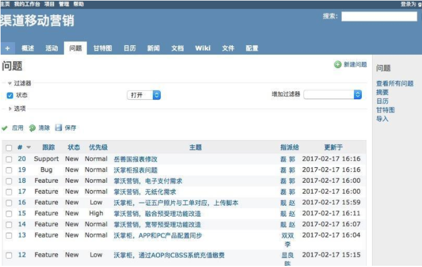
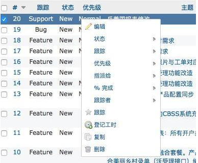

## 3.3 问题跟踪

问题是Redmine的核心业务。 一个问题绑定到一个项目, 由某一用于创建, 可以关联到某一版本, 等等。

* **查看某一问题**

  在问题列表页面点击某一问题的链接, 可以查看该问题的具体描述。

* **过滤器的应用**

  默认情况下, 问题列表显示了所有处于打开状态的问题。 你可以添加过滤器, 点击"应用"链接刷新问题列表, 点击"清除"链接删除设置的滤器。

  可以通过点击"+"号按钮, 为过滤器字段选择多个值。 这时会出现一个选择列表, 按住"ctrl"后, 可选择多个值。

* **自定义查询**

  当刷新页面后, 刚设置的过滤器就会消失, 可以通过点击"保存"链接保存你设置的过滤器, 从而建立自定义查询。

  在新建自定义查询的界面输入自定义查询的名称, 以及过滤器和其他属性的设置。

  点击保存之后, 新建的自定义查询将会出现在问题列表界面的右边栏中。

* **快捷菜单**

  

  在问题列表的某一个问题上, 点击鼠标右键, 将弹出一个快捷菜单, 用于便捷编辑问题。 通过快捷菜单可以快修改问题的进度。

* **新建问题**

  要创建新的问题, 需要有新建问题的权限。
  创建问题时, 最重要的字段是跟踪标签字段, 它决定了问题的类型。
  默认情况下, Redmine有三种跟踪标签:
  功能 feature
  缺陷 bug
  支持 support