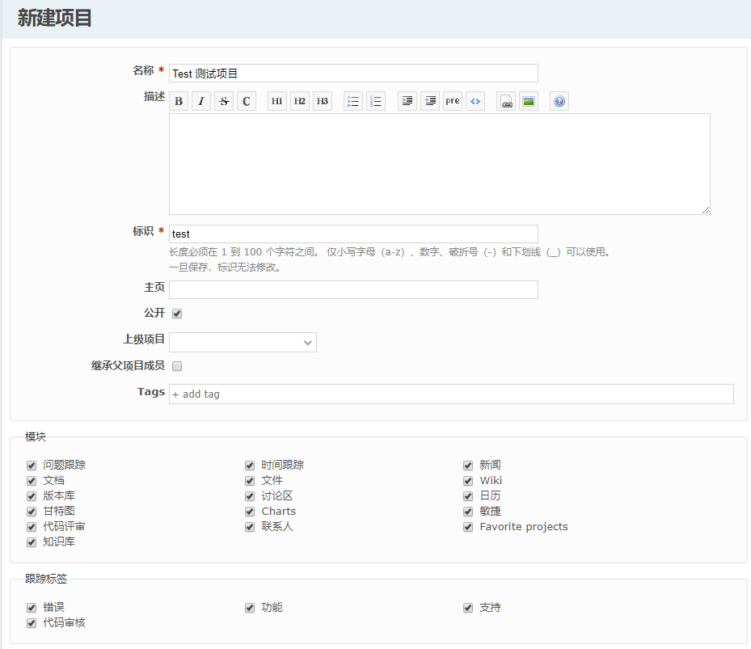

## 3.1 新建项目

“项目”页面中右上角菜单依次是“新建项目”“查看所有问题”“全部活动”。

新建项目需要填写下面信息：

**1. ** 项目的名称，可输入中文

**2. **从下拉列表里选择上级栏目（不选择表示一级项目）对项目简单描述

**3. **填写标识（默认为与**项目的名称**相同），标识就是项目的唯一名称只允许字母、数字和下划线。

**4. **公开：为登录也能看到

**5. **选择跟踪链接（项目包含的跟踪，在建立问题时使用）

**6. **模块：项目包含的模块（这些是现存的模块，管理员可以添加新的模块以供选择）

