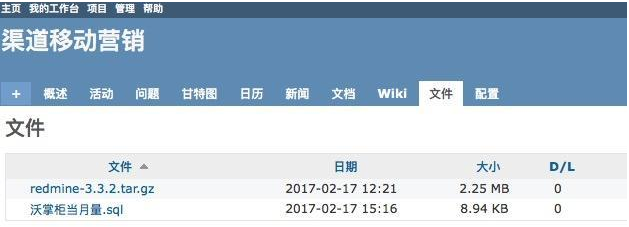

## 3.9 文件

在这里可以上传项目需要用到的其他资源, 如图片, 视频等等。

文件: 类似于网盘的功能，为用户提供文件下载服务的地方 

1. 可以对文件进行统一管理可以方便快速共享文档, 管理文件 
2. 例如一些公共资源，像各个环境的地址等文件 
3. 按照版本分类
4. 可以上传与某个版本相关的文件 
5. 文件大小限制为 10M
6. 不要传过大文件, 大文件应放到其他地方保存(如 FTP)

> ①记得分配权限时，按需分配，不然每个人都可以管理这些文件文档等
>
> ②这些板块都是分项目的，每个项目下都有这些板块，假如在A项目创建这些板块内容，项目B是看不到这些的，相应的只有属于该项目的成员才可以看到这些内容

