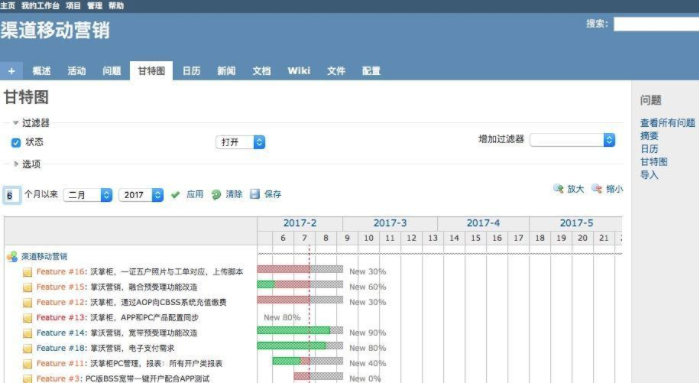

## 3.5 甘特图

Redmine是可以根据建立的问题的开始时间、结束时间和完成百分比自动绘制甘特图的。所以我们要使用redmine的甘特图，必须在新建问题时根据项目计划设置好开始时间，预估结束时间，每天在结束一天的工作后，注意及时更新问题中的完成进度（百分比）。只有这样，数据才能同步到甘特图中。

甘特图中的纵轴代表问题，横轴代表时间。如果你按照上述要求新建、更新问题后，甘特图里中的每个问题都会有一个横条，这个横条的起止位置就代表开始时间和结束时间，长度可以看出问题的持续时长。PS：redmine中的甘特图的时间是当前年份的第n周，并不是具体的几月几号。

横条的颜色代表完成情况，绿色部分为已完成的部分，灰色部分为未完成的部分，如果出现红色，那么说明任务进度过慢，未完成预期的目标。

横轴上有一条红色的虚线，代表当前时间。

如果虚线完全在横条前面，说明任务还未开始；如果虚线在横条中间，说明任务在进行中；如果虚线完全在横条后面，说明已经过了任务完成时间。