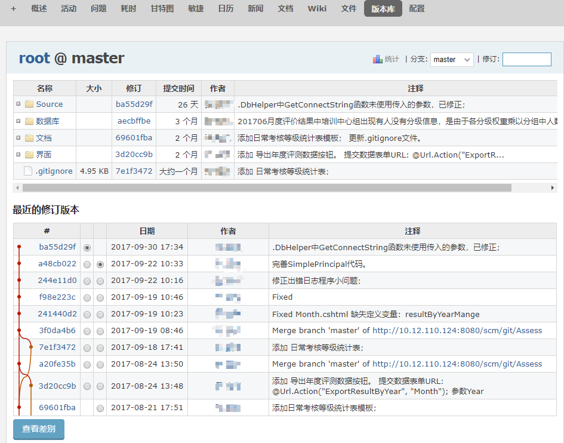
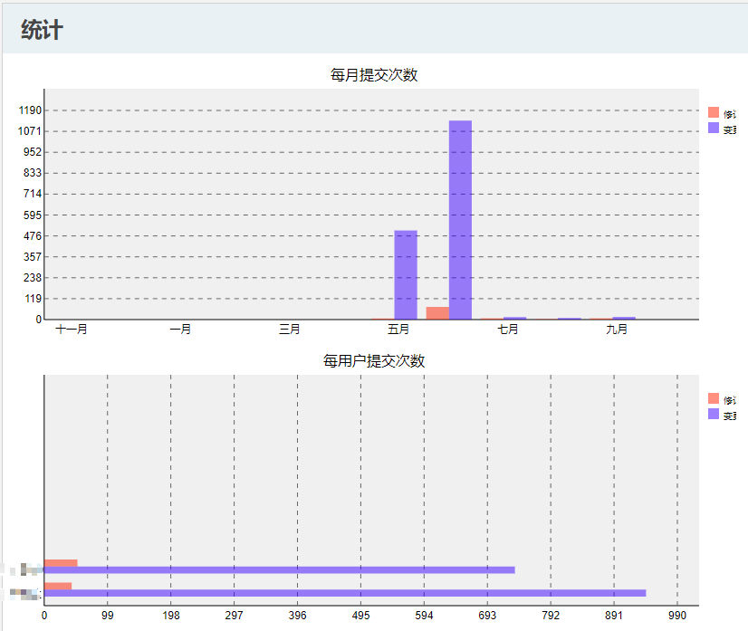

## 3.12 版本库

浏览项目代码的版本库以及最近的提交。

与GitLab 版本管理系统集成，可以看到代码的具体内容以及提交的详细信息。

可以生成两种关于变更和修订数量的版本库图片。 上面的一幅按月份显示变更和修订数量; 下面的一幅按提交者显示变更和修订数量。

**名词解释**

- **修订** 是版本库的提交次数, 显示为橘红色。
- **变更** 是对版本库中文件的修改次数, 显示为蓝色。

