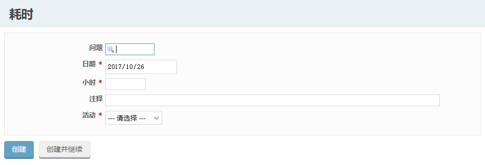
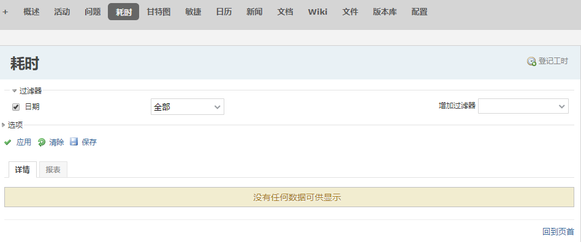

## 3.4 耗时

允许你跟踪解决某一具体问题所花费的时间。 通过填写预期时间, 项目经理可以根据你的进度更好地制定项目计划。 同时实时跟踪与项目成员建立了关联, 从而有效的度量了每个成员的工作情况。

- 给问题登记工时

  通过点击问题浏览页面上"登记工时"的链接, 可以给该问题登记工时。

  

  预计耗时字段可填入的时间格式如下:

  - 整数格式的小时和分钟: 1, 1h, 1hour, 2hours, 30m, 30min, 1h30, 1h30m, 1:30
  - 小数格式的小时: 1.5 1,5(等于1h30)

  你也可以在更新问题时填入工时

- 项目级别的登记工时

  如果登记工时时问题字段为空, 那么该工时就属于整个项目的工时。

