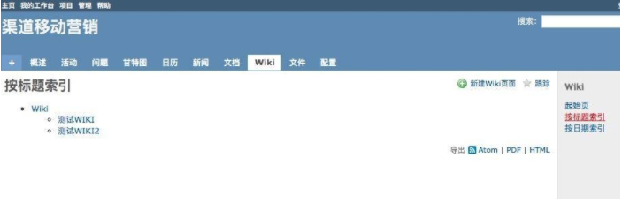

## 3.11 Wikis

Wiki简单说来就是一种集体写作的平台，我们可以在某个项目下建立wiki，然后将针对这一项目所进行的工作都记录到里面。这不是简单的个人日志，其他跟此项目相关的人员也可以对wiki进行编辑。

具体一点，整个项目小组的人都可以编辑wiki，这样大家可以看到彼此的工作，可以提高用户协作能力，提高工作效率。

Redmine的Wiki语法支持 [Textile](http://www.redmine.org/projects/redmine/wiki/RedmineTextFormattingTextile) 和 [Markdown](http://www.redmine.org/projects/redmine/wiki/RedmineTextFormattingMarkdown) 两种格式。

