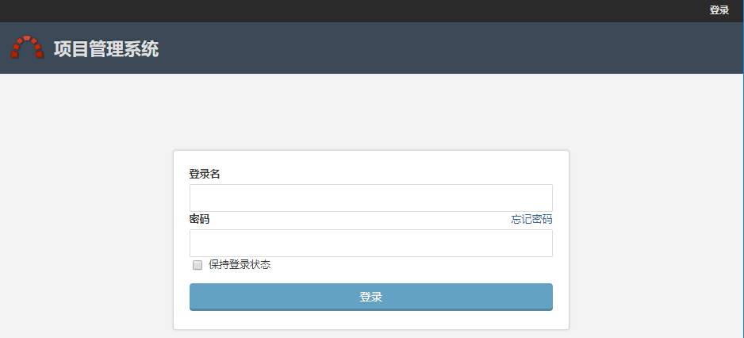
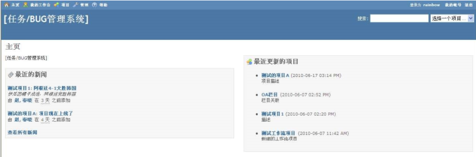
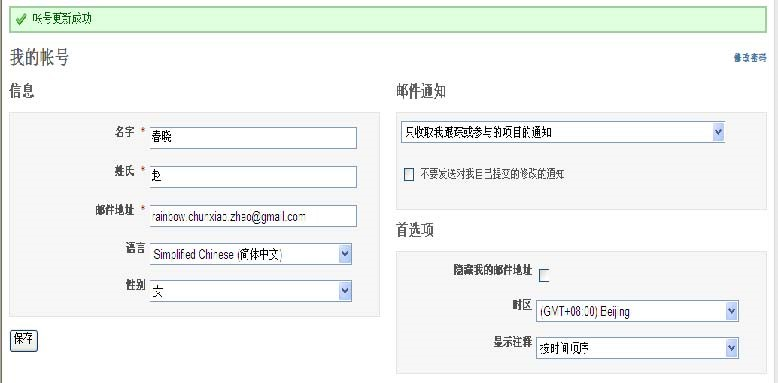
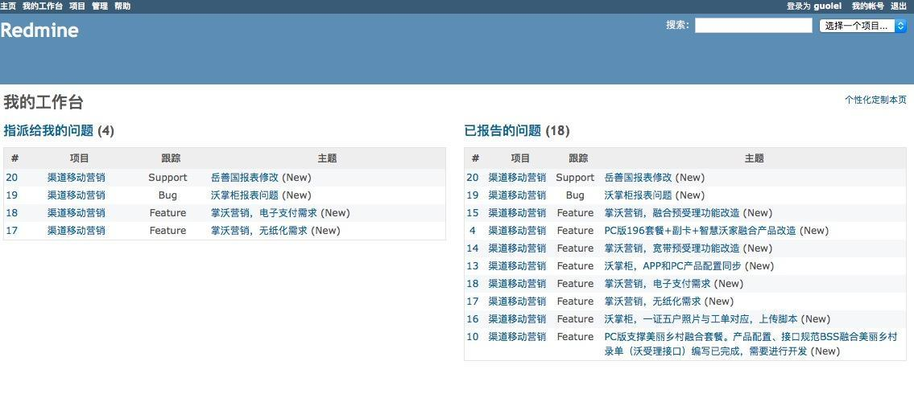

## 2. 用户账号

### 2.1 登陆系统

连接到redmine页面将显示登陆界面，使用账号和密码进行登陆。

登陆成功后会看到“我的主页”界面

### 2.2 账号设置

点击顶部菜单右上角的"我的账号"，进入账号设置。

- 信息：该区域用于修改用户的姓名、邮件地址和语言设置。

- 邮件通知：可以根据自己的需要选择不同的邮件通知策略

  - 只收取我跟踪或参与的项目的通知
  - 收取我的项目的所有通知

  同时，你也可以选种下拉框下面的那个复选框（不要发送对我自己提交的修改的通知），这样就可以避免接收到你自己活动的邮件通知。

- 首选项

  - 隐藏我的邮件地址：如果选中，那么在显示你个人信息的页面将不会显示你的邮件地址。

  - 时区：用于设置你所在的时区，以便更好显示你的活动时间。

  - 显示注释：用于设置注释显示的顺序。

    **按时间顺序**：此时问题(issues)的历史记录按照时间顺序显示，即先提交的comments显示在前面，具体可参见下面的截图。

    **按时间顺序（倒序）**：此时问题(issues)的历史记录按照时间顺序倒序显示，即先提交的comments显示在后面，具体可参见下面的截图。

### 2.3 我的工作台

点击主页左上角的"我的工作台"链接，页面将跳转的当前用户的工作台，这里的板块是我们想要经常使用的。具体板块设置可以根据自己的需求个性化定制。点击右上角的“个性化定制本页”就可以完成个性化工作平台的设置

* 指派给我的问题 

  提供一个跨项目的指派给当前用户的问题列表，显示问题的ID，项目，跟踪标类型签和主题。

* 已报告的问题

  提供一个跨项目的由当前用户报告的问题列表，显示问题的ID，项目，跟踪标签类型和主题。 每一个用户可以通过点击"个性化定制本页"的链接个性化我的工作台。 然后用户可以选择哪些可用的模块被显示:

* 日历

  提供一个跨项目的每周日历概述

* 文档

  提供一个跨项目的最近文档概述

* 最近的新闻

  提供一个跨项目的最近新闻概述

* 耗时

  提供一个跨项目的关于当前用户最近7天工时的概述

* 跟踪的问题

  提供一个跨项目的由当前用户跟踪的问题列表

